# 注册中心

## 服务端

> 官网：https://nacos.io/zh-cn/index.html
>
> 下载：https://github.com/alibaba/nacos/releases

Windows 下，下载压缩包，解压，打开 bin，双击 startup.cmd 可以直接开启服务

打开：http://localhost:8848/nacos

用户名密码都是 nacos


## 客户端

1. 新建一个项目 consumer-service

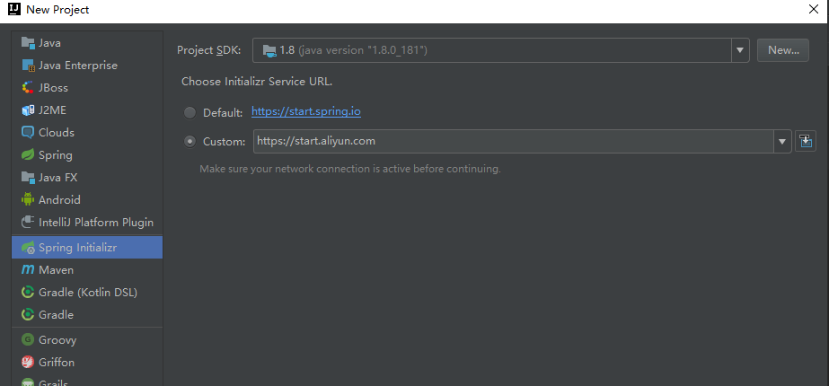

2. 输入 maven 信息

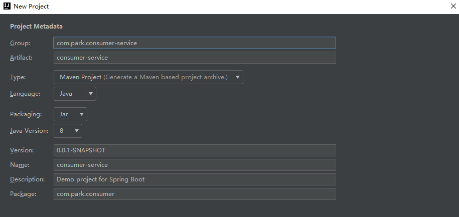

3. 添加依赖，Spring Web、Nacos Service Discovery

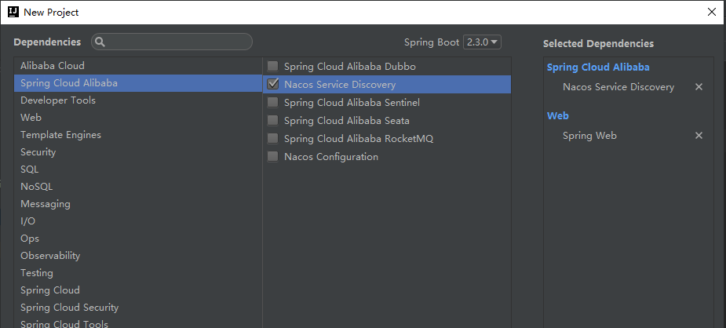

4. 配置文件 application.yml

```
server:
  port: 8800

spring:
  application:
    name: consumer-service
  cloud:
    nacos:
      discovery:
        server-addr: 127.0.0.1:8848
```

5. 启动服务，打开服务列表，可以看到已经注册上了

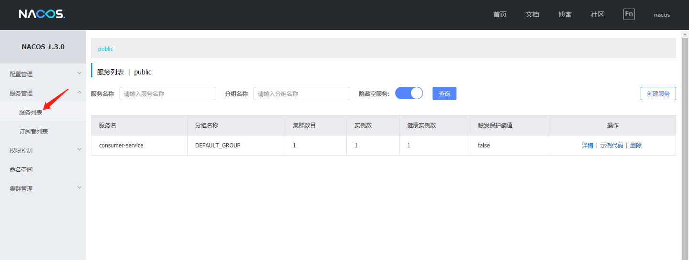

# 远程服务调用

## 服务接口定义

1. 创建一个简单的 maven Java project，dubbo-api

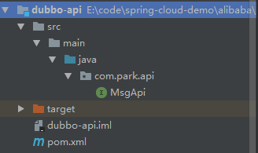

2. 加一个接口

```
package com.park.api;

/**
 * @author BarryLee
 */
public interface MsgApi {
  String send(String name);
}
```

3. 打成 jar 包

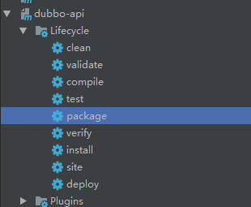

## 服务提供方

1. 添加一个模块，provider-service，依赖选择 Spring Web、Nacos Service Discovery、Spring Boot Actuator、Spring Cloud Alibaba Dubbo

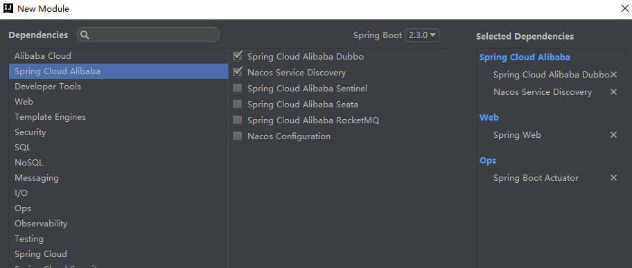

2. 添加对 dubbo-api 的依赖

```
<dependency>
    <groupId>org.example</groupId>
    <artifactId>dubbo-api</artifactId>
    <version>1.0-SNAPSHOT</version>
</dependency>
```

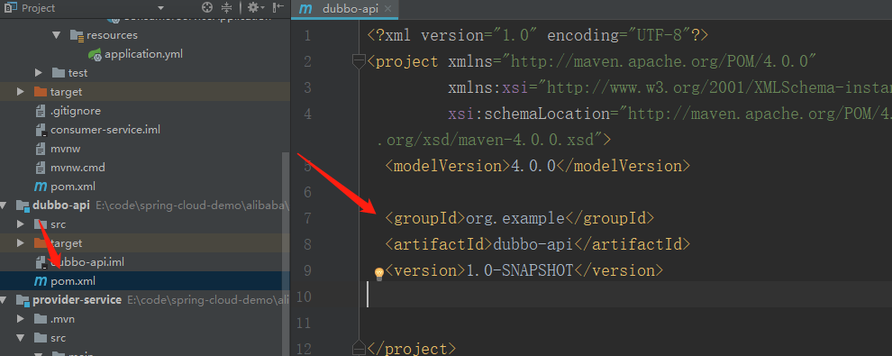

3. 添加一个类

```
package com.park.providerservice.msg;

import com.park.api.MsgApi;
import org.apache.dubbo.config.annotation.Service;
import org.springframework.beans.factory.annotation.Value;

/**
 * @author BarryLee
 */
@Service
public class MsgService implements MsgApi {

  @Value("${server.port}")
  private String port;

  @Override
  public String send(String name) {
    System.out.println(name);
    return "provider --> " + port;
  }

}
```

4. 配置文件

```
server:
  port: 9900

spring:
  application:
    name: provider-service
  cloud:
    nacos:
      discovery:
        server-addr: 127.0.0.1:8848
  main:
    allow-bean-definition-overriding: true
```

## 服务调用方

1. 创建一个项目 consumer-service，依赖选择 actuator、web、nacos-discovery

2. 配置文件

```
server:
  port: 8800

spring:
  application:
    name: consumer-service
  cloud:
    nacos:
      discovery:
        server-addr: 127.0.0.1:8848
  main:
    allow-bean-definition-overriding: true
```

3. 添加一个 controller 类

```
package com.park.consumerservice.controller;

import com.park.api.MsgApi;
import org.apache.dubbo.config.annotation.Reference;
import org.springframework.beans.factory.annotation.Value;
import org.springframework.web.bind.annotation.GetMapping;
import org.springframework.web.bind.annotation.PathVariable;
import org.springframework.web.bind.annotation.RestController;

/**
 * @author BarryLee
 */
@RestController
public class AccountController {

  @Value("${server.port}")
  private String port;

  @Reference
  private MsgApi api;

  @GetMapping("/reg/{name}")
  public String reg(@PathVariable String name) {
    System.out.println(name);
    return "consumer --> " + port + ", " + api.send(name);
  }

}

```

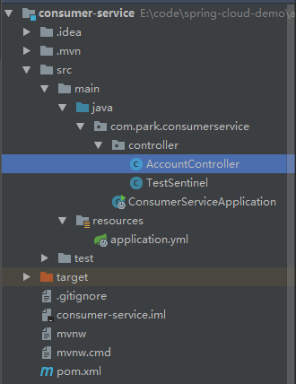

4. 启动服务，浏览器输入：http://localhost:8800/reg/aa

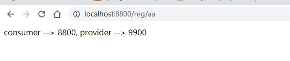

# 负载均衡

## 默认负载策略

dubbo 中有四种 LB 的方式：随机、轮询、最少活跃和一致哈希

dubbo 的默认 LB 策略是随机（RandomLoadBalance）

可以在 provider 里面加几个配置文件分别启动进行测试

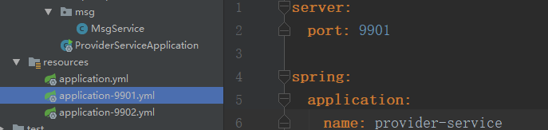

## 修改负载策略

> random 随机
>
> roundrobin 轮询
>
> leastactive 最少活跃数
>
> consistenthash 一致性 hash

```
dubbo:
  provider:
    loadbalance: roundrobin
```

# 熔断限流

1. 下载 sentinel：https://github.com/alibaba/Sentinel/releases ，默认端口是8080
2. 打开：http://localhost:8080/ ，用户名密码都是 sentinel
3. 调用几次，可以监控到 QPS 的实时情况

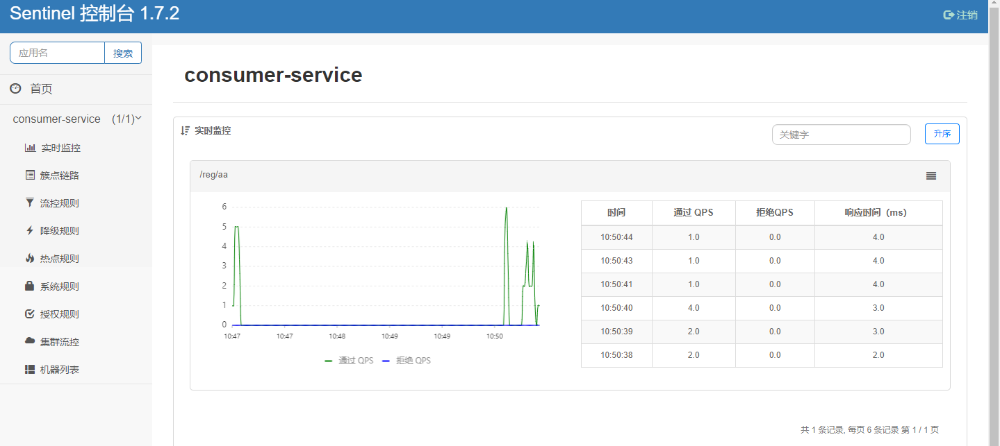

4. 簇点链路可以做限流

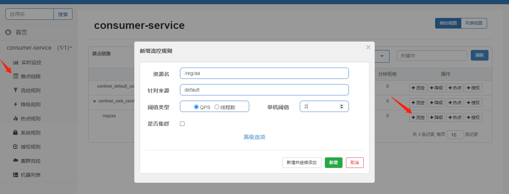

5. 快速调用接口，sentinel 限流成功


# 网关

 https://www.cnblogs.com/jian0110/p/12862569.html 

注意命名空间！

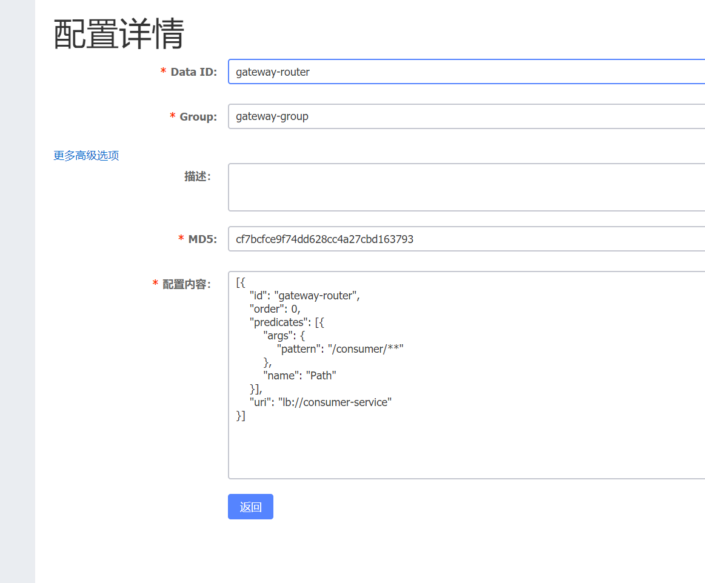


配置：

```
[{
    "id": "gateway-router",
    "order": 0,
    "predicates": [{
        "args": {
            "pattern": "/consumer/**"
        },
        "name": "Path"
    }],
    "uri": "lb://consumer-service"
}]
```


负载，默认随机

 https://cloud.tencent.com/developer/article/1575502 


sentinel使用

 http://blog.didispace.com/spring-cloud-alibaba-sentinel-1/ 

dashboard：默认 localhost:8080

降级： http://blog.didispace.com/spring-cloud-alibaba-sentinel-2-5/ 


https://github.com/alibaba/spring-cloud-alibaba/blob/master/spring-cloud-alibaba-examples/nacos-example/nacos-discovery-example/readme-zh.md


https://github.com/alibaba/spring-cloud-alibaba/blob/master/spring-cloud-alibaba-examples/nacos-example/nacos-discovery-example/readme-zh.md