# Eureka Server 注册中心搭建

## 单节点搭建

1. File -> new -> project 新建项目，然后选择镜像：https://start.aliyun.com

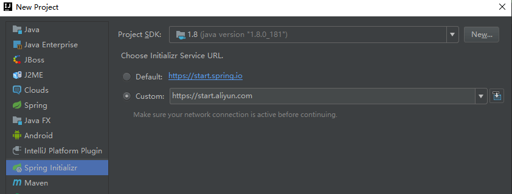

2. 写 maven 配置


3. 选择Eureka Server，然后 Next 选择文件路径，确定，等待项目依赖加载完成

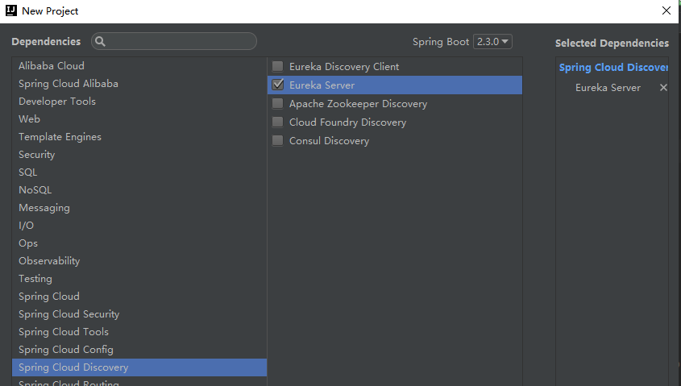

4. 在启动类加上 @EnableEurekaServer 注解

```java
package com.park.eurekaserver;

import org.springframework.boot.SpringApplication;
import org.springframework.boot.autoconfigure.SpringBootApplication;
import org.springframework.cloud.netflix.eureka.server.EnableEurekaServer;

/**
 * @author BarryLee
 */
@EnableEurekaServer
@SpringBootApplication
public class EurekaServerApplication {

    public static void main(String[] args) {
        SpringApplication.run(EurekaServerApplication.class, args);
    }

}
```

5. 将 application.properties 配置文件改为 application.yml

```
#这个和service-url一致，否则会发现unavailable
server.port=7900
#是否将自己注册到Eureka Server,默认为true，由于当前就是server，故而设置成false，表明该服务不会向eureka注册自己的信息
eureka.client.register-with-eureka=false
#是否从eureka server获取注册信息，由于单节点，不需要同步其他节点数据，用false
eureka.client.fetch-registry=false
#设置服务注册中心的URL，用于client和server端交流
eureka.client.service-url.defaultZone=http://localhost:7900/eureka/
```

6. 启动，然后打开  http://localhost:7900/  

## 高可用集群搭建

1. 修改 hosts 文件，win10 位置为：C:\Windows\System32\drivers\etc

   修改 hosts 失败参考文章：https://blog.csdn.net/Zandysjtu/article/details/68542104

```
host文件末尾加上
127.0.0.1 eureka-7900
127.0.0.1 eureka-7901
127.0.0.1 eureka-7902
```

2. 在上述操作的基础上，添加一个文件 application-eureka-7900.yml

```
server:
  port: 7900
eureka:
  client:
    #是否将自己注册到Eureka Server,默认为true，由于当前就是server，故而设置成false，表明该服务不会向eureka注册自己的信息
    register-with-eureka: true
    #是否从eureka server获取注册信息，由于单节点，不需要同步其他节点数据，用false
    fetch-registry: true
    service-url:
      #设置服务注册中心的URL，用于client和server端交流
      defaultZone: http://eureka-7901:7901/eureka/,http://eureka-7902:7902/eureka/
  instance:
    #主机名，必填
    hostname: eureka-7900
```

3. application-eureka-7901.yml

```
server:
  port: 7901
eureka:
  client:
    #是否将自己注册到Eureka Server,默认为true，由于当前就是server，故而设置成false，表明该服务不会向eureka注册自己的信息
    register-with-eureka: true
    #是否从eureka server获取注册信息，由于单节点，不需要同步其他节点数据，用false
    fetch-registry: true
    service-url:
      #设置服务注册中心的URL，用于client和server端交流
      defaultZone: http://eureka-7900:7900/eureka/,http://eureka-7902:7902/eureka/
  instance:
    hostname: eureka-7901
```

4. application-eureka-7902.yml

```
server:
  port: 7902
eureka:
  client:
    #是否将自己注册到Eureka Server,默认为true，由于当前就是server，故而设置成false，表明该服务不会向eureka注册自己的信息
    register-with-eureka: true
    #是否从eureka server获取注册信息，由于单节点，不需要同步其他节点数据，用false
    fetch-registry: true
    service-url:
      #设置服务注册中心的URL，用于client和server端交流
      defaultZone: http://eureka-7900:7900/eureka/,http://eureka-7901:7901/eureka/
  instance:
    hostname: eureka-7902
```

5. 到这里，就搭建完了，然后运行起来

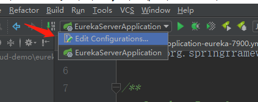

6. 复制三个，并指定 profile，其他两个一样

   然后确定，指定这三个配置文件将服务启动起来，中间肯定会有报错的，因为在相互注册，而其他的服务还没起来，起来之后打开：http://localhost:7900/ ，unavaliable 一定是空的才对

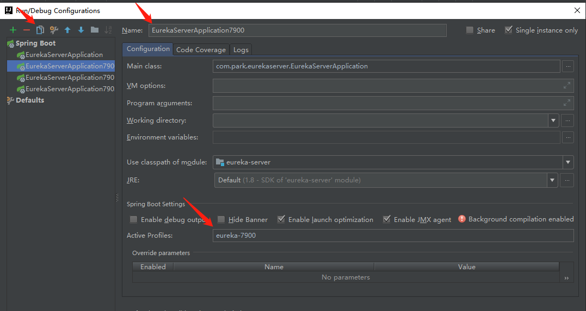

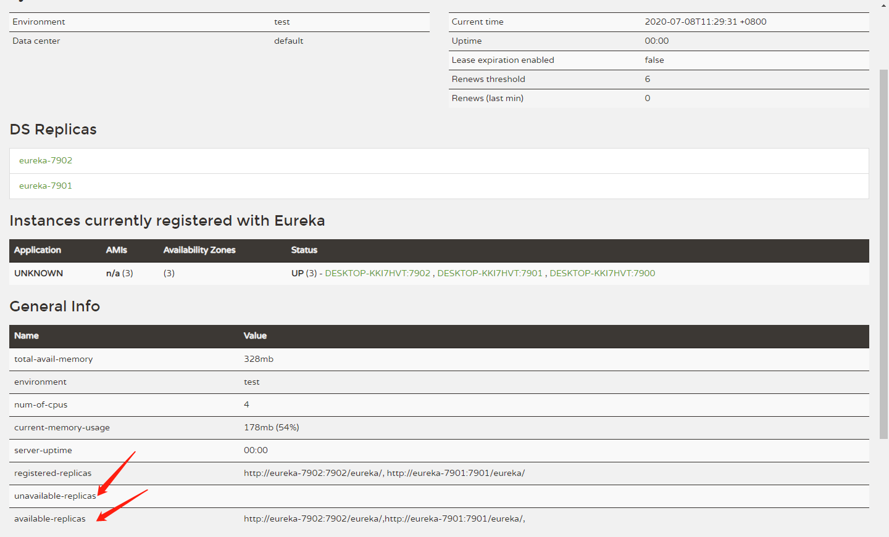

# Eureka Client 搭建

1. 打开 Project  Structure，选择 Module

   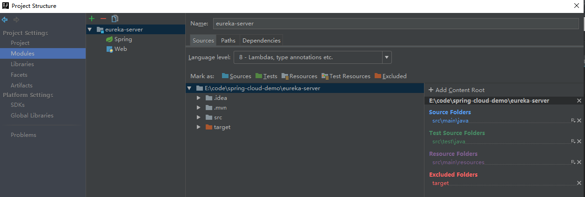

2. 添加一个模块 consumer

   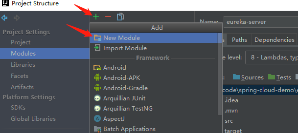

   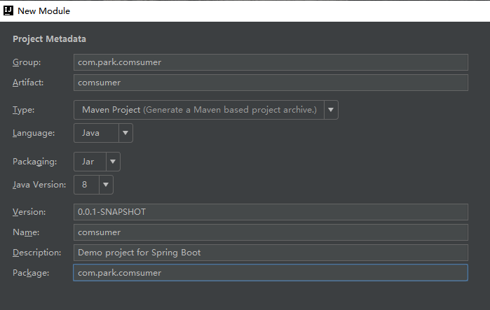

3. 添加依赖 Spring Web 以及 Eureka Client，然后 Next 选择文件路径，确定，等待项目依赖加载完成

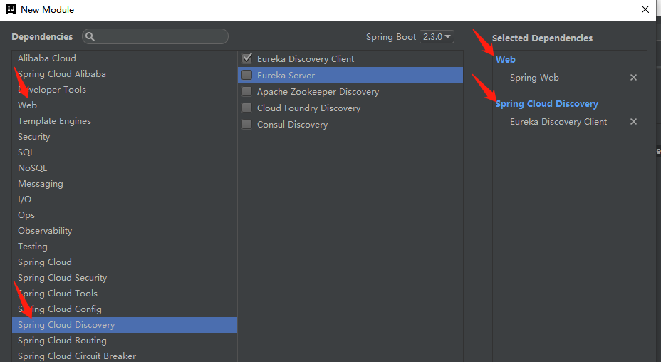

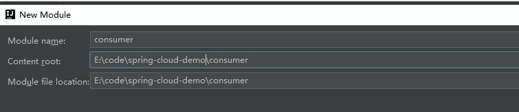

4. 然后看到的项目应该是酱紫的

   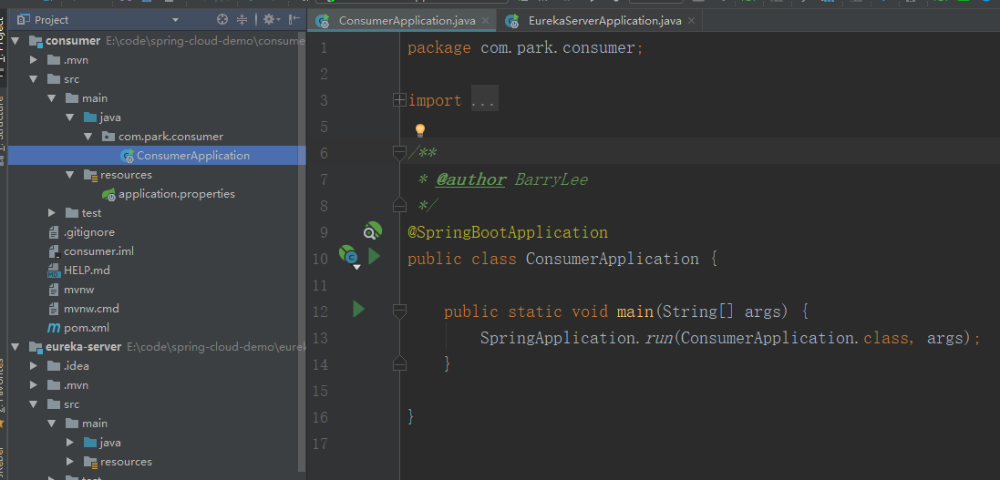

5. 在启动类添加注解 @EnableEurekaClient

   ```
   package com.park.consumer;
   
   import org.springframework.boot.SpringApplication;
   import org.springframework.boot.autoconfigure.SpringBootApplication;
   import org.springframework.cloud.netflix.eureka.EnableEurekaClient;
   
   /**
    * @author BarryLee
    */
   @EnableEurekaClient
   @SpringBootApplication
   public class ConsumerApplication {
   
       public static void main(String[] args) {
           SpringApplication.run(ConsumerApplication.class, args);
       }
   
   }
   ```

6. 将配置文件 application.properties 改为 application.yml

```
server:
  port: 8800
spring:
  application:
    name: consumer
eureka:
  client:
    register-with-eureka: true
    fetch-registry: true
    service-url:
      defaultZone: http://eureka-7901:7901/eureka/
```

7. 启动服务，分别打开 http://localhost:7900/，http://localhost:7901/ ，http://localhost:7902/ 可以看到 consumer 已经成功注册到了注册中心

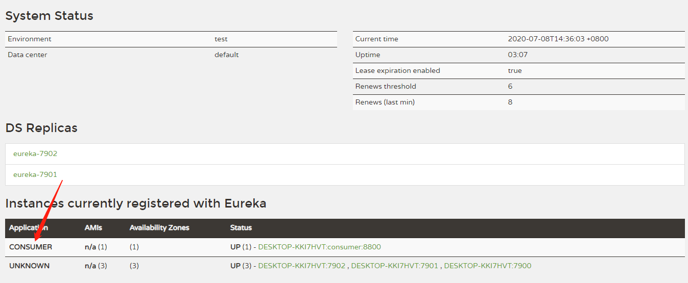

# OpenFeign 引入

1. 准备一个 provider 服务。使用上述同样方法搭建一个 provider 服务（作为公用 API 方，比如发送各种消息的服务）：引入 web 以及 discover client 依赖；在启动类添加注解 @EnableEurekaClient；修改配置文件如下

   ```
   server:
     port: 8800
   spring:
     application:
       name: consumer
   eureka:
     client:
       register-with-eureka: true
       fetch-registry: true
       service-url:
         defaultZone: http://eureka-7901:7901/eureka/
   ```

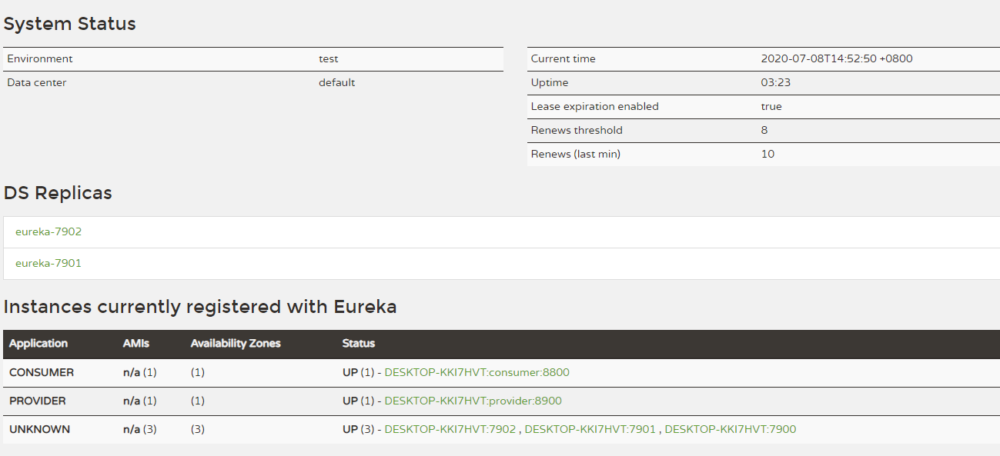

2. provider 增加 lombok 依赖

```
<dependency>
    <groupId>org.projectlombok</groupId>
    <artifactId>lombok</artifactId>
    <version>1.18.8</version>
</dependency>
```

3. provider 服务 添加两个类

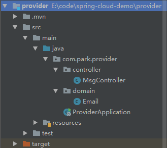

MsgController 类用来处理 consumer 发过来的请求

```
package com.park.provider.controller;

import com.park.provider.domain.Email;
import org.springframework.web.bind.annotation.PostMapping;
import org.springframework.web.bind.annotation.RequestBody;
import org.springframework.web.bind.annotation.RequestMapping;
import org.springframework.web.bind.annotation.RestController;

/**
 * @author BarryLee
 */
@RestController
@RequestMapping("/msg")
public class MsgController {

    @PostMapping("/sendEmail")
    public Email sendEmail(@RequestBody Email email) {
        System.out.println("provider 收到邮件：" + email);
        email.setContent("偷偷改一下内容");
        return email;
    }

}
```

```
package com.park.provider.domain;

import lombok.Data;

/**
 * @author BarryLee
 */
@Data
public class Email {
    private String email;
    private String content;
}
```

4. consumer 引入 OpenFeign 组件

```
<dependency>
    <groupId>org.springframework.cloud</groupId>
    <artifactId>spring-cloud-starter-openfeign</artifactId>
</dependency>

<!-- 顺便引入 lombok -->
<dependency>
    <groupId>org.projectlombok</groupId>
    <artifactId>lombok</artifactId>
    <version>1.18.8</version>
</dependency>
```

5. 在 consumer 的启动类添加注解：@EnableFeignClients

6. consumer 中添加几个类，Email 同 provider

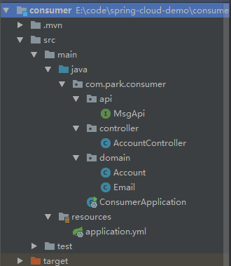

```
package com.park.consumer.domain;

import lombok.Data;

/**
 * @author BarryLee
 */
@Data
public class Account {
    private Integer id;
    private String username;
    private String password;
    private String email;
}
```

```
package com.park.consumer.api;

import com.park.consumer.domain.Email;
import org.springframework.cloud.openfeign.FeignClient;
import org.springframework.web.bind.annotation.PostMapping;
import org.springframework.web.bind.annotation.RequestBody;

/**
 * 这个类的所有注解都是给 Feign 看的，它会根据这里的注解来去组装一个 http 请求
 * 注解 FeignClient 标注服务名
 * @author BarryLee
 */
@FeignClient(name = "provider")
public interface MsgApi {
    /**
     * OpenFeign 相比较 Feign，它可以支持 SpringMVC 注解
     * 发送邮件
     */
    @PostMapping("/msg/sendEmail")
    Email sendEmail(@RequestBody Email email);
}

```

```
package com.park.consumer.controller;

import com.netflix.discovery.converters.Auto;
import com.park.consumer.api.MsgApi;
import com.park.consumer.domain.Account;
import com.park.consumer.domain.Email;
import org.springframework.beans.factory.annotation.Autowired;
import org.springframework.web.bind.annotation.PostMapping;
import org.springframework.web.bind.annotation.RequestBody;
import org.springframework.web.bind.annotation.RequestMapping;
import org.springframework.web.bind.annotation.RestController;

/**
 * @author BarryLee
 */
@RestController
@RequestMapping("/account")
public class AccountController {

    @Autowired
    private MsgApi msgApi;

    @PostMapping("/register")
    public Account register(@RequestBody Account account) {
        System.out.println("consumer 收到注册请求：" + account);

        Email email = new Email();
        email.setEmail(account.getEmail());
        email.setContent("打开网址xxx，激活你的账号噢");

        // 使用 OpenFeign 调用
        final Email res = msgApi.sendEmail(email);
        System.out.println("consumer 收到 provider 返回结果：" + res);

        account.setId(222);
        return account;
    }

}
```

7. 使用 postman 发送 post 请求测试 OpenFeign 调用

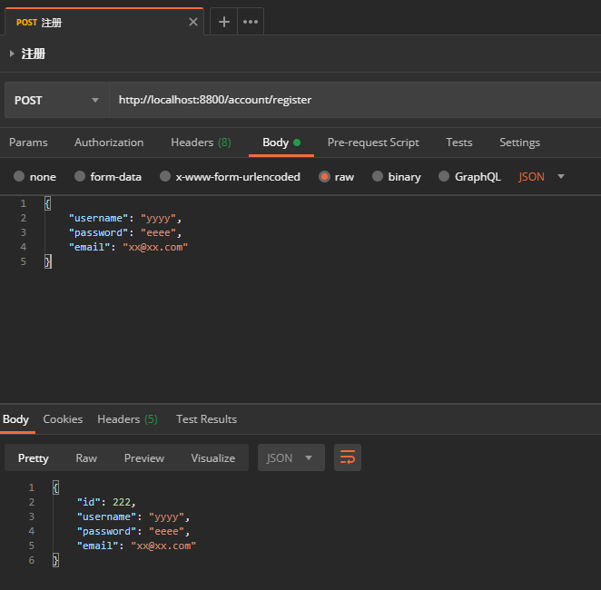

consumer 控制台输出

```
consumer 收到注册请求：Account(id=null, username=yyyy, password=eeee, email=xx@xx.com)
consumer 收到 provider 返回结果：Email(email=xx@xx.com, content=偷偷改一下内容)
```

provider 控制台输出

```
provider 收到邮件：Email(email=xx@xx.com, content=打开网址xxx，激活你的账号噢)
```

# Ribbon 客户端负载均衡

## 默认的负载算法

1. 其实 OpenFeign 已经集成了 Ribbon 组件，如果上面的操作正确，那么一个轮询算法已经生效了。下面验证一下

2. 给 provider 服务添加两个配置文件，application-8901.yml 配置如下

```
server:
  port: 8901
spring:
  application:
    name: provider
eureka:
  client:
    register-with-eureka: true
    fetch-registry: true
    service-url:
      defaultZone: http://eureka-7901:7901/eureka/
```

3. application-8902.yml 就跟 8901 的一样，端口号改成 8902 即可

4. 在 IDEA 的 EditConfiguration  中给 provider 配置这两个配置文件

5. provider 的 MsgController 类修改如下

```
    @Value("${server.port}")
    private String port;

    @PostMapping("/sendEmail")
    public String sendEmail(@RequestBody Email email) {
        System.out.println("provider port：" + port);
        System.out.println("provider 收到邮件：" + email);
        email.setContent("偷偷改一下内容");
        return port;
    }
```

6. consumer 的 MsgApi 修改如下

```
    @PostMapping("/msg/sendEmail")
    String sendEmail(@RequestBody Email email);
```

7. consumer 的 AccountController 修改如下

```
    @Autowired
    private MsgApi msgApi;

    @PostMapping("/register")
    public Account register(@RequestBody Account account) {
        System.out.println("consumer 收到注册请求：" + account);

        Email email = new Email();
        email.setEmail(account.getEmail());
        email.setContent("打开网址xxx，激活你的账号噢");

        // 使用 OpenFeign 调用
        String res = msgApi.sendEmail(email);
        System.out.println("consumer 收到 provider 返回端口：" + res);

		// 设置id为调用的 provider 的端口，方便直接查看调用情况
        account.setId(Integer.parseInt(res));
        return account;
    }
```

8. 下面开始测试，使用 postman 反复调用接口，可以发现端口是轮询出现的

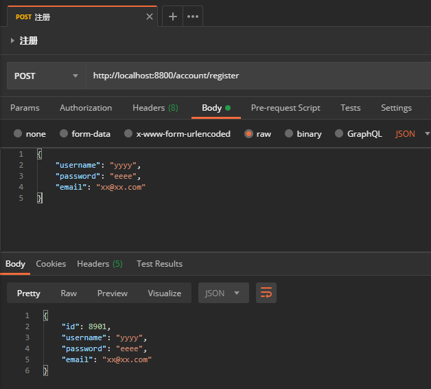

## 修改负载算法


