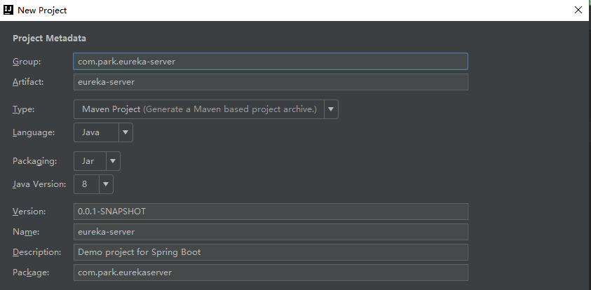

# Eureka注册中心搭建

## 单节点搭建

1. File -> new -> project 新建项目，然后选择镜像：https://start.aliyun.com


2. 写 maven 配置



3. 选择Eureka Server，然后 Next 选择文件路径，确定，等待项目依赖加载完成


4. 在启动类加上 @EnableEurekaServer 注解

```java
package com.park.eurekaserver;

import org.springframework.boot.SpringApplication;
import org.springframework.boot.autoconfigure.SpringBootApplication;
import org.springframework.cloud.netflix.eureka.server.EnableEurekaServer;

/**
 * @author BarryLee
 */
@EnableEurekaServer
@SpringBootApplication
public class EurekaServerApplication {

    public static void main(String[] args) {
        SpringApplication.run(EurekaServerApplication.class, args);
    }

}
```

5. 将 application.properties 配置文件改为 application.yml

```
#这个和service-url一致，否则会发现unavailable
server.port=7900
#是否将自己注册到Eureka Server,默认为true，由于当前就是server，故而设置成false，表明该服务不会向eureka注册自己的信息
eureka.client.register-with-eureka=false
#是否从eureka server获取注册信息，由于单节点，不需要同步其他节点数据，用false
eureka.client.fetch-registry=false
#设置服务注册中心的URL，用于client和server端交流
eureka.client.service-url.defaultZone=http://localhost:7900/eureka/
```

6. 启动，然后打开  http://localhost:7900/  

## 高可用集群搭建

1. 修改 hosts 文件，win10 位置为：C:\Windows\System32\drivers\etc

   修改 hosts 失败参考文章：https://blog.csdn.net/Zandysjtu/article/details/68542104

```
host文件末尾加上
127.0.0.1 eureka-7900
127.0.0.1 eureka-7901
127.0.0.1 eureka-7902
```

2. 在上述操作的基础上，添加一个文件 application-eureka-7900.properties

```
#web端口，服务是由这个端口处理rest请求的
server.port=7900
#是否将自己注册到其他Eureka Server,默认为true 需要
eureka.client.register-with-eureka=true
#是否从eureka server获取注册信息， 需要
eureka.client.fetch-registry=true
#设置服务注册中心的URL，用于client和server端交流
#此节点应向其他节点发起请求
eureka.client.serviceUrl.defaultZone=http://eureka-7901:7901/eureka/,http://eureka-7902:7902/eureka/
#主机名，必填
eureka.instance.hostname=eureka-7900
management.endpoint.shutdown.enabled=true
```

3. application-eureka-7901.properties

```
#web端口，服务是由这个端口处理rest请求的
server.port=7901
#是否将自己注册到其他Eureka Server,默认为true 需要
eureka.client.register-with-eureka=true
#是否从eureka server获取注册信息， 需要
eureka.client.fetch-registry=true
#设置服务注册中心的URL，用于client和server端交流
#此节点应向其他节点发起请求
eureka.client.serviceUrl.defaultZone=http://eureka-7900:7900/eureka/,http://eureka-7902:7902/eureka/
#主机名，必填
eureka.instance.hostname=eureka-7901
management.endpoint.shutdown.enabled=true
```

4. application-eureka-7902.properties

```
#web端口，服务是由这个端口处理rest请求的
server.port=7902
#是否将自己注册到其他Eureka Server,默认为true 需要
eureka.client.register-with-eureka=true
#是否从eureka server获取注册信息， 需要
eureka.client.fetch-registry=true
#设置服务注册中心的URL，用于client和server端交流
#此节点应向其他节点发起请求
eureka.client.serviceUrl.defaultZone=http://eureka-7900:7900/eureka/,http://eureka-7901:7901/eureka/
#主机名，必填
eureka.instance.hostname=eureka-7902
management.endpoint.shutdown.enabled=true
```

5. 到这里，就搭建完了，然后运行起来


6. 复制三个，并指定 profile，其他两个一样

   然后确定，将这三个服务启动起来，中间肯定会有报错的，因为在相互注册，而其他的服务还没起来，起来之后打开：http://localhost:7900/ ，unavaliable 一定是空的才对


