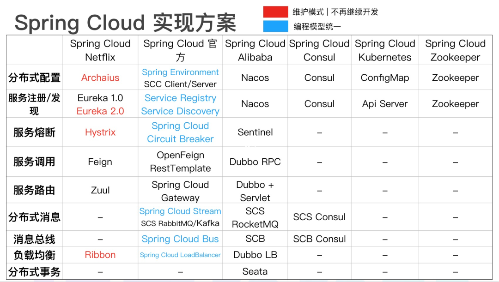

微服务架构概述，推荐文章

https://www.cnblogs.com/liuning8023/p/4493156.html

# Spring Cloud 的几套实现方案

# Spring Cloud 技术点

Eureka：服务注册与发现，用于服务管理

Feign： web调用客户端，能够简化 HTTP 接口的调用

Ribbon：基于客户端的负载均衡

Hystrix：熔断降级，防止服务雪崩

Zuul：网关路由，提供路由转发、请求过滤、限流降级等功能

Config：配置中心，分布式配置管理

Sleuth：服务链路追踪

Admin：健康管理

# Spring Cloud Alibaba

**[Sentinel](https://github.com/alibaba/Sentinel)**：把流量作为切入点，从流量控制、熔断降级、系统负载保护等多个维度保护服务的稳定性

**[Nacos](https://github.com/alibaba/Nacos)**：一个更易于构建云原生应用的动态服务发现、配置管理和服务管理平台

**[RocketMQ](https://rocketmq.apache.org/)**：一款开源的分布式消息系统，基于高可用分布式集群技术，提供低延时的、高可靠的消息发布与订阅服务

**[Dubbo](https://github.com/apache/dubbo)**：Apache Dubbo™ 是一款高性能 Java RPC 框架

**[Seata](https://github.com/seata/seata)**：阿里巴巴开源产品，一个易于使用的高性能微服务分布式事务解决方案

**[Alibaba Cloud ACM](https://www.aliyun.com/product/acm)**：一款在分布式架构环境中对应用配置进行集中管理和推送的应用配置中心产品

**[Alibaba Cloud OSS](https://www.aliyun.com/product/oss)**: 阿里云对象存储服务（Object Storage Service，简称 OSS），是阿里云提供的海量、安全、低成本、高可靠的云存储服务。您可以在任何应用、任何时间、任何地点存储和访问任意类型的数据

**[Alibaba Cloud SchedulerX](https://help.aliyun.com/document_detail/43136.html)**: 阿里中间件团队开发的一款分布式任务调度产品，提供秒级、精准、高可靠、高可用的定时（基于 Cron 表达式）任务调度服务

**[Alibaba Cloud SMS](https://www.aliyun.com/product/sms)**: 覆盖全球的短信服务，友好、高效、智能的互联化通讯能力，帮助企业迅速搭建客户触达通道

# 微服务设计原则

单一职责原则：关注整个系统功能中单独，有界限的一部分

服务自治原则：可以独立开发，测试，构建，部署，运行，与其他服务解耦

轻量级通信原则：轻，跨平台，跨语言。REST, AMQP 等

粒度把控：与自己实际相结合。 不要追求完美，随业务进化而调整。《淘宝技术这10年》

# 服务注册与发现

# 服务间调用

# 负载均衡

# 熔断

# 网关

# 配置中心

