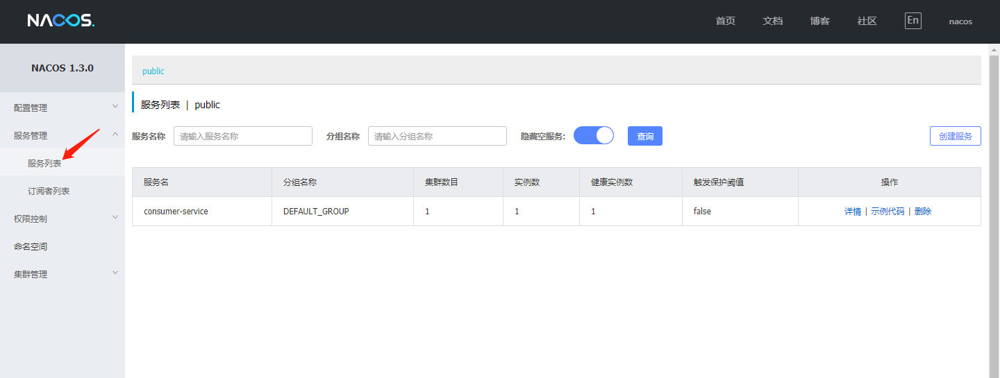

# 注册中心

## 服务端

> 官网：https://nacos.io/zh-cn/index.html
>
> 下载：https://github.com/alibaba/nacos/releases

Windows 下，下载压缩包，解压，打开 bin，双击 startup.cmd 可以直接开启服务

打开：http://localhost:8848/nacos

用户名密码都是 nacos


## 客户端

1. 新建一个项目 consumer-service


2. 输入 maven 信息


3. 添加依赖，Spring Web、Nacos Service Discovery


4. 启动类

```

package com.park.consumer;

import org.springframework.boot.SpringApplication;
import org.springframework.boot.autoconfigure.SpringBootApplication;
import org.springframework.cloud.client.discovery.EnableDiscoveryClient;

/**
 * @author BarryLee
 */
@EnableDiscoveryClient
@SpringBootApplication
public class ConsumerApplication {

    public static void main(String[] args) {
        SpringApplication.run(ConsumerApplication.class, args);
    }

}

```

5. 配置文件 application.yml

```
server:
  port: 8800

spring:
  application:
    name: consumer-service
  cloud:
    nacos:
      discovery:
        server-addr: 127.0.0.1:8848
```

6. 启动服务，打开服务列表，可以看到已经注册上了



# 声明式服务调用

## 服务提供方

1. 添加一个模块，provider-service，依赖同样选择 Spring Web、Nacos Service Discovery


2. 瞄一眼目录结构


3. 修改配置文件 application.yml

```
server:
  port: 9900

spring:
  application:
    name: provider-service
  cloud:
    nacos:
      discovery:
        server-addr: 127.0.0.1:8848
```

4. 启动类添加注解

```
@EnableDiscoveryClient
```

5. 添加一个 Controller 来接收请求

```
package com.park.provider.controller;

import com.park.provider.domain.Account;
import org.springframework.beans.factory.annotation.Value;
import org.springframework.web.bind.annotation.PostMapping;
import org.springframework.web.bind.annotation.RequestBody;
import org.springframework.web.bind.annotation.RestController;

/**
 * @author BarryLee
 */
@RestController
public class MsgController {

    @Value("${server.port}")
    private String port;

    @PostMapping("/send")
    public String send(@RequestBody Account account) {
        System.out.println("provider " + port + ", name=" + account.getName());
        return "provider-->" + port;
    }

}

```

6. Account 

添加 Lombok 的依赖

```
<!-- lombok -->
<dependency>
    <groupId>org.projectlombok</groupId>
    <artifactId>lombok</artifactId>
</dependency>
```

Account 类

```
@Data
public class Account {
    private String name;
}
```

7. 启动 provider-service，到 nacos 服务列表可以查看到 provider-service 已经注册好了

## 服务调用方


1. 添加依赖

```
<!-- openfeign -->
<dependency>
    <groupId>org.springframework.cloud</groupId>
    <artifactId>spring-cloud-starter-openfeign</artifactId>
</dependency>

<!-- lombok -->
<dependency>
    <groupId>org.projectlombok</groupId>
    <artifactId>lombok</artifactId>
</dependency>
```

2. 启动类添加注解

```
@EnableFeignClients
```

3. 添加接口 ProviderApi

```
package com.park.consumer.api;

import com.park.consumer.domain.Account;
import org.springframework.cloud.openfeign.FeignClient;
import org.springframework.web.bind.annotation.PostMapping;

/**
 * @author BarryLee
 */
@FeignClient(name = "provider-service")
public interface ProviderApi {

    @PostMapping("/send")
    String send(Account account);

}
```

4. 添加 AccountController

```
package com.park.consumer.controller;

import com.park.consumer.api.ProviderApi;
import com.park.consumer.domain.Account;
import org.springframework.beans.factory.annotation.Autowired;
import org.springframework.beans.factory.annotation.Value;
import org.springframework.web.bind.annotation.PostMapping;
import org.springframework.web.bind.annotation.RequestBody;
import org.springframework.web.bind.annotation.RestController;

/**
 * @author BarryLee
 */
@RestController
public class AccountController {

    @Value("${server.port}")
    private String port;

    @Autowired
    private ProviderApi api;

    @PostMapping("/reg")
    public String reg(@RequestBody Account account) {
        String name = account.getName();
        System.out.println("consumer " + port + ", name=" + name);
        String res = api.send(account);
        return "consumer-->" + port + ", " + res;
    }

}
```

5. Account 类同 provider-service
6. 启动 consumer-service
7. 调用接口进行测试


# 负载均衡

## 默认负载策略

1. provider-service 添加两个配置文件：application-9901.yml，application-9902.yml，分别设置端口 9901 和 9902，并在 Edit Configuration...中配置，这部分细节可以参考 spring-cloud-netflix 的搭建，不再赘述


2. 启动 9901 和 9902，然后继续用 postman 反复调用 consumer 的 /reg 接口，可以发现默认已经是轮询的策略了，其实是 ZoneAvoidanceRule（区域权衡策略），可以到 spring-cloud-netflix 理论基础文档瞧一瞧


## 修改负载策略

1. consumer 的配置文件中，给服务名为 provider-service 的服务修改负载策略为随机算法

```
provider-service:
  ribbon:
    NFLoadBalancerRuleClassName: com.netflix.loadbalancer.RandomRule
```

2. 全局配置方式，在任意被 spring 管理的类，比如启动类或者 @Component 的类中添加如下配置

```
@Bean
public IRule ribbonRule() {
	return new RandomRule();
}
```

其他算法类似

# 熔断

Feign 已经整合了 Hystrix，我们只需要在服务调用方 consumer-service 做一些简单配置即可

1. 配置文件添加

```
feign:
  hystrix:
    enabled: true
```

2. 添加一个类 ProviderFallback

```
package com.park.consumer.fallback;

import com.park.consumer.api.ProviderApi;
import com.park.consumer.domain.Account;
import org.springframework.stereotype.Component;

/**
 * @author BarryLee
 */
@Component
public class ProviderFallback implements ProviderApi{

    @Override
    public String send(Account account) {
        return "我熔断了";
    }

}
```

3. ProviderApi 接口的注解改为

```
@FeignClient(name = "provider-service", fallback = ProviderFallback.class)
```

4. 将 provider-service 的服务都停掉，然后再用 postman 调用 consumer 的 /reg 接口，可以发现调用了 fallback 逻辑


# 网关


https://github.com/alibaba/spring-cloud-alibaba/blob/master/spring-cloud-alibaba-examples/nacos-example/nacos-discovery-example/readme-zh.md