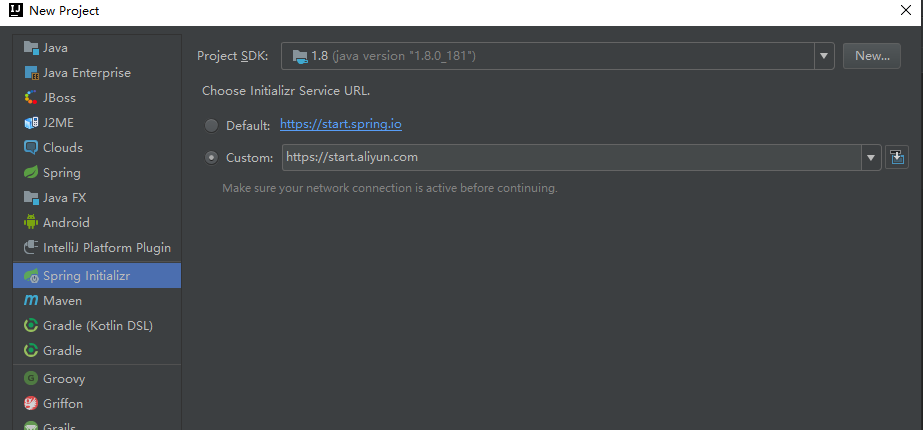
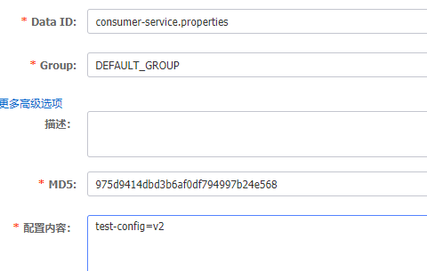

# 注册中心

## 服务端

> 官网：https://nacos.io/zh-cn/index.html
>
> 下载：https://github.com/alibaba/nacos/releases

Windows 下，下载压缩包，解压，打开 bin，双击 startup.cmd 可以直接开启服务

打开：http://localhost:8848/nacos

用户名密码都是 nacos


## 客户端

1. 新建一个项目 consumer-service



2. 输入 maven 信息


3. 添加依赖，Spring Web、Nacos Service Discovery


4. 配置文件 application.yml

```
server:
  port: 8800

spring:
  application:
    name: consumer-service
  cloud:
    nacos:
      discovery:
        server-addr: 127.0.0.1:8848
```

5. 启动服务，打开服务列表，可以看到已经注册上了


## 配置数据库

1. 新建数据库 nacos_config，编码选择 utf8mb4，执行 /nacos/conf/nacos-mysql.sql 脚本，MySQL 版本要求5.6+
2. 打开 /nacos/conf/application.properties，输入配置

```
#mysql
spring.datasource.platform=mysql
db.num=1
db.url.0=jdbc:mysql://xxx:3306/nacos_config?characterEncoding=utf8&connectTimeout=1000&socketTimeout=3000&autoReconnect=true&serverTimezone=GMT
db.user=root
db.password=xxx
```

# 远程服务调用

## 服务接口定义

1. 创建一个简单的 maven Java project，dubbo-api


2. 加一个接口

```
package com.park.api;

/**
 * @author BarryLee
 */
public interface MsgApi {
  String send(String name);
}
```

3. 打成 jar 包


## 服务提供方

1. 添加一个模块，provider-service，依赖选择 Spring Web、Nacos Service Discovery、Spring Boot Actuator、Spring Cloud Alibaba Dubbo


2. 添加对 dubbo-api 的依赖

```
<dependency>
    <groupId>org.example</groupId>
    <artifactId>dubbo-api</artifactId>
    <version>1.0-SNAPSHOT</version>
</dependency>
```


3. 添加一个类

```
package com.park.providerservice.msg;

import com.park.api.MsgApi;
import org.apache.dubbo.config.annotation.Service;
import org.springframework.beans.factory.annotation.Value;

/**
 * @author BarryLee
 */
@Service
public class MsgService implements MsgApi {

  @Value("${server.port}")
  private String port;

  @Override
  public String send(String name) {
    System.out.println(name);
    return "provider --> " + port;
  }

}
```

4. 配置文件

```
server:
  port: 9900

spring:
  application:
    name: provider-service
  cloud:
    nacos:
      discovery:
        server-addr: 127.0.0.1:8848
  main:
    allow-bean-definition-overriding: true
```

## 服务调用方

1. 创建一个项目 consumer-service，依赖选择 actuator、web、nacos-discovery

2. 配置文件

```
server:
  port: 8800

spring:
  application:
    name: consumer-service
  cloud:
    nacos:
      discovery:
        server-addr: 127.0.0.1:8848
  main:
    allow-bean-definition-overriding: true
```

3. 添加一个 controller 类

```
package com.park.consumerservice.controller;

import com.park.api.MsgApi;
import org.apache.dubbo.config.annotation.Reference;
import org.springframework.beans.factory.annotation.Value;
import org.springframework.web.bind.annotation.GetMapping;
import org.springframework.web.bind.annotation.PathVariable;
import org.springframework.web.bind.annotation.RestController;

/**
 * @author BarryLee
 */
@RestController
public class AccountController {

  @Value("${server.port}")
  private String port;

  @Reference
  private MsgApi api;

  @GetMapping("/reg/{name}")
  public String reg(@PathVariable String name) {
    System.out.println(name);
    return "consumer --> " + port + ", " + api.send(name);
  }

}

```


4. 启动服务，浏览器输入：http://localhost:8800/reg/aa


# 负载均衡

## 默认负载策略

dubbo 中有四种 LB 的方式：随机、轮询、最少活跃和一致哈希

dubbo 的默认 LB 策略是随机（RandomLoadBalance）

可以在 provider 里面加几个配置文件分别启动进行测试


## 修改负载策略

> random 随机
>
> roundrobin 轮询
>
> leastactive 最少活跃数
>
> consistenthash 一致性 hash

```
dubbo:
  provider:
    loadbalance: roundrobin
```

# 熔断限流降级

1. 下载 sentinel：https://github.com/alibaba/Sentinel/releases ，默认端口是8080
2. 打开：http://localhost:8080/ ，用户名密码都是 sentinel
3. 调用几次，可以监控到 QPS 的实时情况


4. 簇点链路可以做限流


5. 快速调用接口，sentinel 限流成功


# 网关动态路由配置

## Nacos 配置路由

1. 在 nacos 新建一个命名空间，名称为 dev


2. 配置列表里面选择 dev，新增一个配置


3. Data id 为 gateway-router，group 为 gateway-group，json 格式，内容如下

```
[{
    "id": "gateway-router",
    "order": 0,
    "predicates": [{
        "args": {
            "pattern": "/consumer/**"
        },
        "name": "Path"
    }],
    "uri": "lb://consumer-service"
}]
```


## gateway 服务添加代码

1. 新建一个模块 gateway，添加如下依赖

```
    <!-- gateway -->
    <dependency>
      <groupId>org.springframework.cloud</groupId>
      <artifactId>spring-cloud-starter-gateway</artifactId>
    </dependency>

    <!-- nacos discovery -->
    <dependency>
      <groupId>com.alibaba.cloud</groupId>
      <artifactId>spring-cloud-starter-alibaba-nacos-discovery</artifactId>
    </dependency>

    <!-- nacos conf -->
    <dependency>
      <groupId>com.alibaba.cloud</groupId>
      <artifactId>spring-cloud-starter-alibaba-nacos-config</artifactId>
    </dependency>

    <!-- actuator -->
    <dependency>
      <groupId>org.springframework.boot</groupId>
      <artifactId>spring-boot-starter-actuator</artifactId>
    </dependency>

    <!-- slf4j -->
    <dependency>
      <groupId>org.slf4j</groupId>
      <artifactId>slf4j-api</artifactId>
    </dependency>

    <!-- fastjson -->
    <dependency>
      <groupId>com.alibaba</groupId>
      <artifactId>fastjson</artifactId>
      <version>1.2.47</version>
    </dependency>

    <!-- lombok -->
    <dependency>
      <groupId>org.projectlombok</groupId>
      <artifactId>lombok</artifactId>
    </dependency>
    
```

2. 添加几个类，以及配置文件


3. DynamicRouteServiceImpl 动态更新路由网关service

```
package com.park.gateway.config;

import lombok.extern.slf4j.Slf4j;
import org.springframework.beans.factory.annotation.Autowired;
import org.springframework.cloud.gateway.event.RefreshRoutesEvent;
import org.springframework.cloud.gateway.route.RouteDefinition;
import org.springframework.cloud.gateway.route.RouteDefinitionWriter;
import org.springframework.context.ApplicationEventPublisher;
import org.springframework.context.ApplicationEventPublisherAware;
import org.springframework.stereotype.Service;
import reactor.core.publisher.Mono;

/**
 * 动态更新路由网关service
 * 1）实现一个Spring提供的事件推送接口ApplicationEventPublisherAware
 * 2）提供动态路由的基础方法，可通过获取bean操作该类的方法。该类提供新增路由、更新路由、删除路由，然后实现发布的功能。
 */
@Slf4j
@Service
public class DynamicRouteServiceImpl implements ApplicationEventPublisherAware {
  @Autowired
  private RouteDefinitionWriter routeDefinitionWriter;

  /**
   * 发布事件
   */
  @Autowired
  private ApplicationEventPublisher publisher;

  @Override
  public void setApplicationEventPublisher(ApplicationEventPublisher applicationEventPublisher) {
    this.publisher = applicationEventPublisher;
  }

  /**
   * 删除路由
   *
   * @param id
   * @return
   */
  public String delete(String id) {
    try {
      log.info("gateway delete route id {}", id);
      this.routeDefinitionWriter.delete(Mono.just(id));
      return "delete success";
    } catch (Exception e) {
      return "delete fail";
    }
  }

  /**
   * 更新路由
   *
   * @param definition
   * @return
   */
  public String update(RouteDefinition definition) {
    try {
      log.info("gateway update route {}", definition);
      this.routeDefinitionWriter.delete(Mono.just(definition.getId()));
    } catch (Exception e) {
      return "update fail,not find route  routeId: " + definition.getId();
    }
    try {
      routeDefinitionWriter.save(Mono.just(definition)).subscribe();
      this.publisher.publishEvent(new RefreshRoutesEvent(this));
      return "success";
    } catch (Exception e) {
      return "update route fail";
    }
  }

  /**
   * 增加路由
   *
   * @param definition
   * @return
   */
  public String add(RouteDefinition definition) {
    log.info("gateway add route {}", definition);
    routeDefinitionWriter.save(Mono.just(definition)).subscribe();
    this.publisher.publishEvent(new RefreshRoutesEvent(this));
    return "success";
  }
}
```

4. DynamicRouteServiceImplByNacos 通过nacos下发动态路由配置,监听Nacos中gateway-route配置

```
package com.park.gateway.config;

import com.alibaba.fastjson.JSON;
import com.alibaba.nacos.api.NacosFactory;
import com.alibaba.nacos.api.config.ConfigService;
import com.alibaba.nacos.api.config.listener.Listener;
import com.alibaba.nacos.api.exception.NacosException;
import lombok.extern.slf4j.Slf4j;
import org.springframework.beans.factory.annotation.Autowired;
import org.springframework.cloud.gateway.route.RouteDefinition;
import org.springframework.context.annotation.DependsOn;
import org.springframework.stereotype.Component;

import javax.annotation.PostConstruct;
import java.util.List;
import java.util.Properties;
import java.util.concurrent.Executor;

/**
 * 通过nacos下发动态路由配置,监听Nacos中gateway-route配置
 */
@Component
@Slf4j
@DependsOn({"gatewayConfig"}) // 依赖于gatewayConfig bean
public class DynamicRouteServiceImplByNacos {

  @Autowired
  private DynamicRouteServiceImpl dynamicRouteService;


  private ConfigService configService;

  @PostConstruct
  public void init() {
    log.info("gateway route init...");
    try {
      configService = initConfigService();
      if (configService == null) {
        log.warn("initConfigService fail");
        return;
      }
      String configInfo = configService.getConfig(GatewayConfig.NACOS_ROUTE_DATA_ID, GatewayConfig.NACOS_ROUTE_GROUP, GatewayConfig.DEFAULT_TIMEOUT);
      log.info("获取网关当前配置:\r\n{}", configInfo);
      List<RouteDefinition> definitionList = JSON.parseArray(configInfo, RouteDefinition.class);
      for (RouteDefinition definition : definitionList) {
        log.info("update route : {}", definition.toString());
        dynamicRouteService.add(definition);
      }
    } catch (Exception e) {
      log.error("初始化网关路由时发生错误", e);
    }
    dynamicRouteByNacosListener(GatewayConfig.NACOS_ROUTE_DATA_ID, GatewayConfig.NACOS_ROUTE_GROUP);
  }

  /**
   * 监听Nacos下发的动态路由配置
   *
   * @param dataId
   * @param group
   */
  public void dynamicRouteByNacosListener(String dataId, String group) {
    try {
      configService.addListener(dataId, group, new Listener() {
        @Override
        public void receiveConfigInfo(String configInfo) {
          log.info("进行网关更新:\n\r{}", configInfo);
          List<RouteDefinition> definitionList = JSON.parseArray(configInfo, RouteDefinition.class);
          for (RouteDefinition definition : definitionList) {
            log.info("update route : {}", definition.toString());
            dynamicRouteService.update(definition);
          }
        }

        @Override
        public Executor getExecutor() {
          log.info("getExecutor\n\r");
          return null;
        }
      });
    } catch (NacosException e) {
      log.error("从nacos接收动态路由配置出错!!!", e);
    }
  }

  /**
   * 初始化网关路由 nacos config
   *
   * @return
   */
  private ConfigService initConfigService() {
    try {
      Properties properties = new Properties();
      properties.setProperty("serverAddr", GatewayConfig.NACOS_SERVER_ADDR);
      properties.setProperty("namespace", GatewayConfig.NACOS_NAMESPACE);
      return configService = NacosFactory.createConfigService(properties);
    } catch (Exception e) {
      log.error("初始化网关路由时发生错误", e);
      return null;
    }
  }
}
```

5. GatewayConfig 路由类配置

```
package com.park.gateway.config;

import org.springframework.beans.factory.annotation.Value;
import org.springframework.context.annotation.Configuration;

/**
 * 路由类配置
 */
@Configuration
public class GatewayConfig {
    public static final long DEFAULT_TIMEOUT = 30000;

    public static String NACOS_SERVER_ADDR;

    public static String NACOS_NAMESPACE;

    public static String NACOS_ROUTE_DATA_ID;

    public static String NACOS_ROUTE_GROUP;

    @Value("${spring.cloud.nacos.discovery.server-addr}")
    public void setNacosServerAddr(String nacosServerAddr){
        NACOS_SERVER_ADDR = nacosServerAddr;
    }

    @Value("${spring.cloud.nacos.discovery.namespace}")
    public void setNacosNamespace(String nacosNamespace){
        NACOS_NAMESPACE = nacosNamespace;
    }

    @Value("${nacos.gateway.route.config.data-id}")
    public void setNacosRouteDataId(String nacosRouteDataId){
        NACOS_ROUTE_DATA_ID = nacosRouteDataId;
    }

    @Value("${nacos.gateway.route.config.group}")
    public void setNacosRouteGroup(String nacosRouteGroup){
        NACOS_ROUTE_GROUP = nacosRouteGroup;
    }

}
```

6. application.yml

```
server:
  port: 80

spring:
  application:
    name: gateway
  cloud:
    nacos:
      discovery:
        server-addr: 127.0.0.1:8848

management:
  endpoints:
    web:
      exposure:
        include: '*'

# 配置输出日志
logging:
  level:
    org.springframework.cloud.gateway: TRACE
    org.springframework.http.server.reactive: DEBUG
    org.springframework.web.reactive: DEBUG
    reactor.ipc.netty: DEBUG

```

7. bootstrap.properties

```
# nacos配置中心配置建议在bootstrap.properties中配置
spring.cloud.nacos.config.server-addr=127.0.0.1:8848
#spring.cloud.nacos.config.file-extension=properties
# 配置中心的命名空间：dev 的命名空间（环境）
spring.cloud.nacos.config.namespace=824219a8-c18e-4f04-b9c4-0175bc6ed602

spring.cloud.nacos.discovery.server-addr=127.0.0.1:8848
spring.cloud.nacos.discovery.namespace=824219a8-c18e-4f04-b9c4-0175bc6ed602
nacos.gateway.route.config.data-id=gateway-router
nacos.gateway.route.config.group=gateway-group
```

## 测试

1. 启动 gateway，可以看到如下日志，表示成功拉取了配置。如果此时对配置进行修改，日志里面也应该可以看到更新的信息了


2. 修改一下 consumer 和 provider 的配置，将他们也改为 dev 的命名空间下

```
server:
  port: 8800
  servlet:
    context-path: /consumer

spring:
  application:
    name: consumer-service
  cloud:
    nacos:
      discovery:
        namespace: 824219a8-c18e-4f04-b9c4-0175bc6ed602
        server-addr: 127.0.0.1:8848
      config:
        namespace: 824219a8-c18e-4f04-b9c4-0175bc6ed602
```

```
spring:
  application:
    name: provider-service
  cloud:
    nacos:
      discovery:
        namespace: 824219a8-c18e-4f04-b9c4-0175bc6ed602
        server-addr: 127.0.0.1:8848
      config:
        namespace: 824219a8-c18e-4f04-b9c4-0175bc6ed602
```

3. 重启 consumer、provider


4. 测试直接从 consumer 调用接口：http://localhost:8800/consumer/reg/aa，确认可以之后，通过网关调用：http://localhost/consumer/reg/aa


# 配置中心

1. 在 nacos 的 dev 命名空间添加一个配置

   > Data Id 跟 spring.application.name 对应
   >
   > Group 使用默认的
   >
   > 配置内容简单的加一个 test-config=v2



2. consumer-service 添加一个配置文件 bootstrap.properties

```
spring.application.name=consumer-service

spring.cloud.nacos.config.server-addr=127.0.0.1:8848
spring.cloud.nacos.config.namespace=824219a8-c18e-4f04-b9c4-0175bc6ed602
```

3. 添加依赖

```
<!-- nacos cinfig -->
<dependency>
    <groupId>com.alibaba.cloud</groupId>
    <artifactId>spring-cloud-starter-alibaba-nacos-config</artifactId>
</dependency>
```

4. AccountController 类，添加注解 @RefreshScope，添加接口 testConfig

```
/**
 * @author BarryLee
 */
@RestController
@RefreshScope
public class AccountController {

    @Value("${test-config}")
    private String testConfig;
    @GetMapping("/test-config")
    public String testConfig() {
        return testConfig;
    }

}

```

5. 启动 consumer-service，请求接口：http://localhost:8800/consumer/test-config 查看结果
6. 在 nacos 修改 consumer-service.properties，test-config 改为 v3，再次请求 /test-config 接口，可以看到返回结果已经改变

# 链路追踪


## skywalking

1. 下载：http://skywalking.apache.org/zh/downloads/
2. win 下打开 /bin/startup.cmd
3. 默认占用 8080 端口：http://localhost:8080/，账号密码都是 admin
4. idea 部署探针的方式：

```
-javaagent:D:\skywalking\apache-skywalking-apm-bin\agent\skywalking-agent.jar 
-Dskywalking.agent.service_name=consumer-service 
-Dskywalking.collector.backend_service=localhost:11800 
```

5. Jar 启动方式

```
java -javaagent:/xx/skywalking-agent.jar -Dskywalking.agent.service_name=consumer-service -Dskywalking.collector.backend_service=localhost:11800 -jar consumer-service.jar
```

# 健康检查

与 Netflix 的一样