# Eureka Server 注册中心搭建

## 单节点搭建

1. File -> new -> project 新建项目，然后更换镜像：https://start.aliyun.com

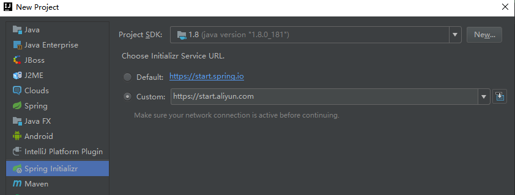

2. 输入 maven 配置

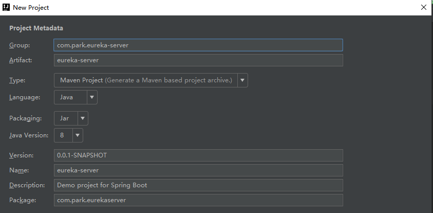

3. 选择 Eureka Server 依赖，然后 Next 选择文件路径，确定，等待项目依赖加载完成

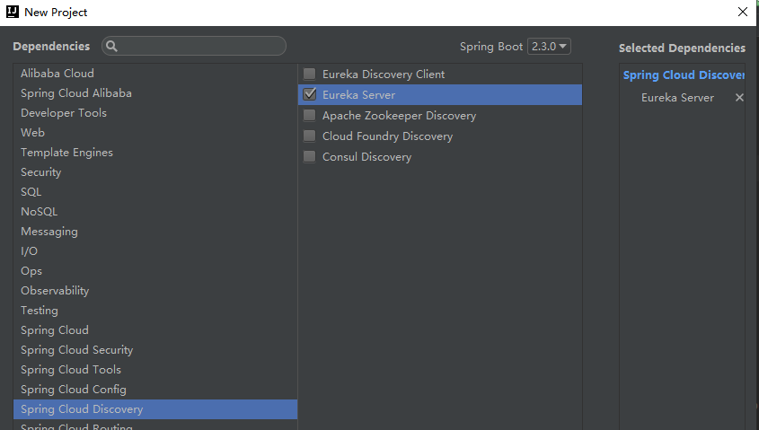

4. 在启动类加上 @EnableEurekaServer 注解，表示这是一个注册中心服务端

```java
package com.park.eurekaserver;

import org.springframework.boot.SpringApplication;
import org.springframework.boot.autoconfigure.SpringBootApplication;
import org.springframework.cloud.netflix.eureka.server.EnableEurekaServer;

/**
 * @author BarryLee
 */
@EnableEurekaServer
@SpringBootApplication
public class EurekaServerApplication {

    public static void main(String[] args) {
        SpringApplication.run(EurekaServerApplication.class, args);
    }

}
```

5. 将 application.properties 配置文件改为 application.yml

```
server:
  port: 7900

eureka:
  client:
    #是否将自己注册到Eureka Server,默认为true，由于当前就是server，故而设置成false，表明该服务不会向eureka注册自己的信息
    register-with-eureka: false
    #是否从eureka server获取注册信息，由于单节点，不需要同步其他节点数据，用false
    fetch-registry: false
    service-url:
      #设置服务注册中心的URL，用于client和server端交流
      defaultZone: http://localhost:7900/eureka/
```

6. 启动，然后打开  http://localhost:7900/  

## 高可用集群搭建

1. 修改 hosts 文件，win10 位置为：C:\Windows\System32\drivers\etc

   修改 hosts 失败参考文章：https://blog.csdn.net/Zandysjtu/article/details/68542104

```
host文件末尾加上
127.0.0.1 eureka-7900
127.0.0.1 eureka-7901
127.0.0.1 eureka-7902
```

2. 在上述操作的基础上，添加一个配置文件 application-eureka-7900.yml

```
server:
  port: 7900

eureka:
  client:
    #是否将自己注册到Eureka Server,默认为true，由于当前就是server，故而设置成false，表明该服务不会向eureka注册自己的信息
    register-with-eureka: true
    #是否从eureka server获取注册信息，由于单节点，不需要同步其他节点数据，用false
    fetch-registry: true
    service-url:
      #设置服务注册中心的URL，用于client和server端交流
      defaultZone: http://eureka-7901:7901/eureka/,http://eureka-7902:7902/eureka/
  instance:
    #主机名，必填
    hostname: eureka-7900
```

3. application-eureka-7901.yml

```
server:
  port: 7901

eureka:
  client:
    #是否将自己注册到Eureka Server,默认为true，由于当前就是server，故而设置成false，表明该服务不会向eureka注册自己的信息
    register-with-eureka: true
    #是否从eureka server获取注册信息，由于单节点，不需要同步其他节点数据，用false
    fetch-registry: true
    service-url:
      #设置服务注册中心的URL，用于client和server端交流
      defaultZone: http://eureka-7900:7900/eureka/,http://eureka-7902:7902/eureka/
  instance:
    hostname: eureka-7901
```

4. application-eureka-7902.yml

```
server:
  port: 7902

eureka:
  client:
    #是否将自己注册到Eureka Server,默认为true，由于当前就是server，故而设置成false，表明该服务不会向eureka注册自己的信息
    register-with-eureka: true
    #是否从eureka server获取注册信息，由于单节点，不需要同步其他节点数据，用false
    fetch-registry: true
    service-url:
      #设置服务注册中心的URL，用于client和server端交流
      defaultZone: http://eureka-7900:7900/eureka/,http://eureka-7901:7901/eureka/
  instance:
    hostname: eureka-7902
```

5. 关掉原来的单节点服务，Edit Configurations  ...

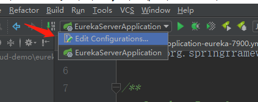

6. 选中 EurekaServerApplication 复制三个；三个都修改 Name，并指定 Active profiles

   然后确定，指定这三个配置文件将服务启动起来，中间肯定会有报错的，因为在相互注册，而其他的服务还没起来，起来之后打开：http://localhost:7900/ ，unavaliable 一定是空的才对

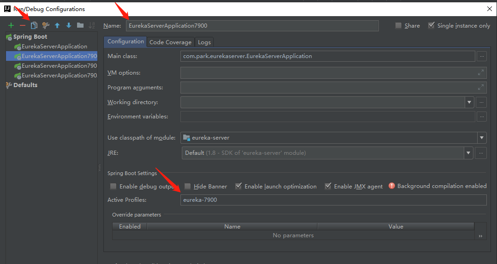

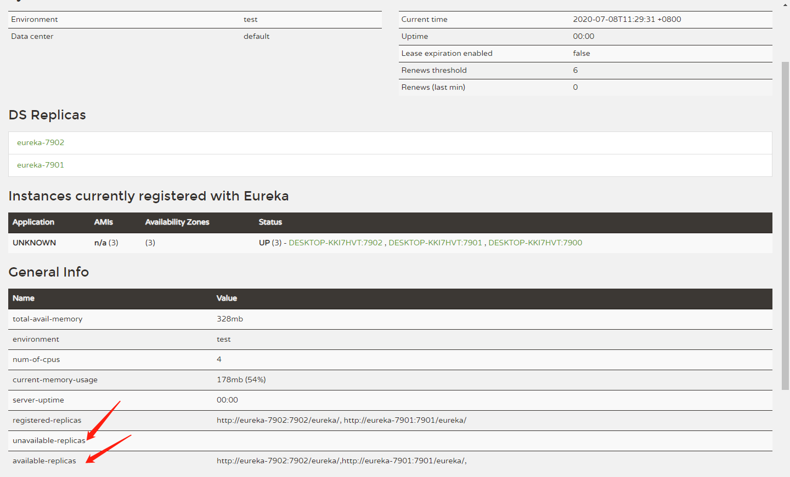

# Eureka Client 搭建

1. 打开 Project  Structure，选择 Module

   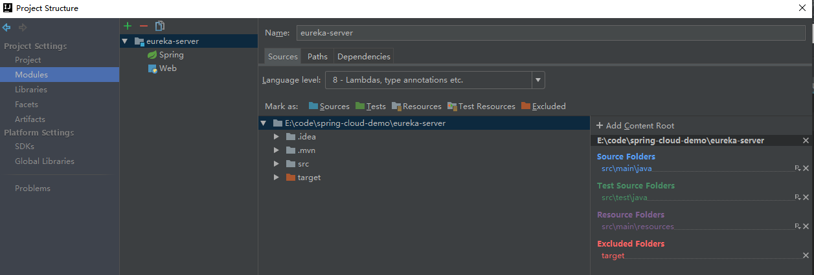

2. 添加一个 new module 模块 consumer

   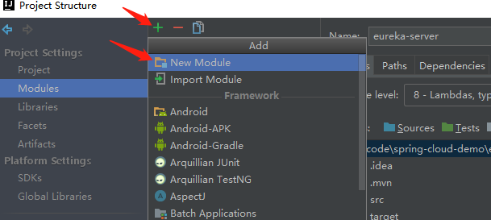

   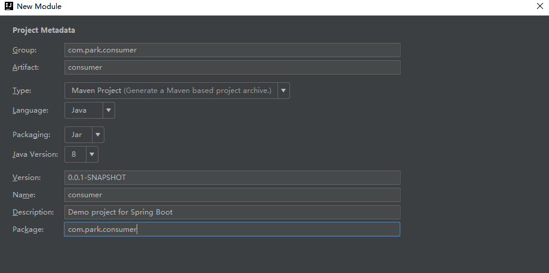

3. 添加依赖 Spring Web 以及 Eureka Client，然后 Next 选择文件路径，确定，等待项目依赖加载完成

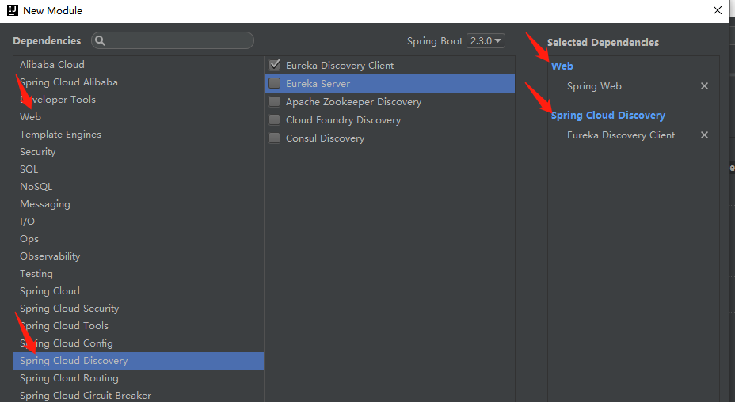

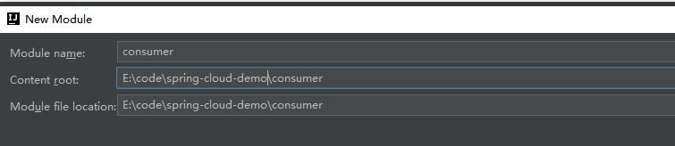

4. 然后看到的项目应该是酱紫的

   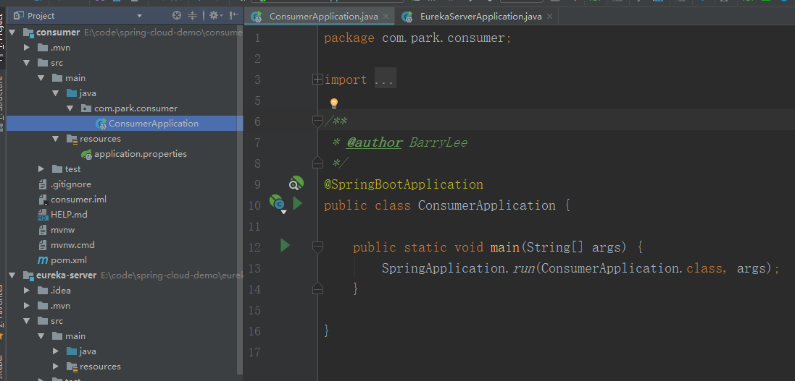

5. 在启动类添加注解 @EnableEurekaClient，表示这是一个注册中心的客户端

```
package com.park.consumer;

import org.springframework.boot.SpringApplication;
import org.springframework.boot.autoconfigure.SpringBootApplication;
import org.springframework.cloud.netflix.eureka.EnableEurekaClient;

/**
 * @author BarryLee
 */
@EnableEurekaClient
@SpringBootApplication
public class ConsumerApplication {

    public static void main(String[] args) {
        SpringApplication.run(ConsumerApplication.class, args);
    }

}
```

4. 将配置文件 application.properties 改为 application.yml

```
server:
  port: 8800
spring:
  application:
    name: consumer
eureka:
  client:
    register-with-eureka: true
    service-url:
      defaultZone: http://localhost:7900/eureka/
```

7. 启动服务，分别打开 http://localhost:7900/，http://localhost:7901/ ，http://localhost:7902/ 可以看到 consumer 已经成功注册到了注册中心

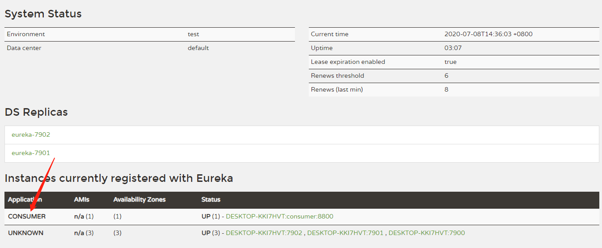

# OpenFeign 声明式服务调用

1. 准备一个 provider 服务。使用上述同样方法搭建一个 provider 服务（作为公用 API 方，比如发送各种消息的服务）：引入 web 以及 discover client 依赖；在启动类添加注解 @EnableEurekaClient；

   修改配置文件如下

```
server:
  port: 8800
spring:
  application:
  	# 服务名为 consumer
    name: consumer
eureka:
  client:
    register-with-eureka: true
    service-url:
      defaultZone: http://localhost:7900/eureka/
```

启动服务，打开 eureka，看到 provider 也注册了

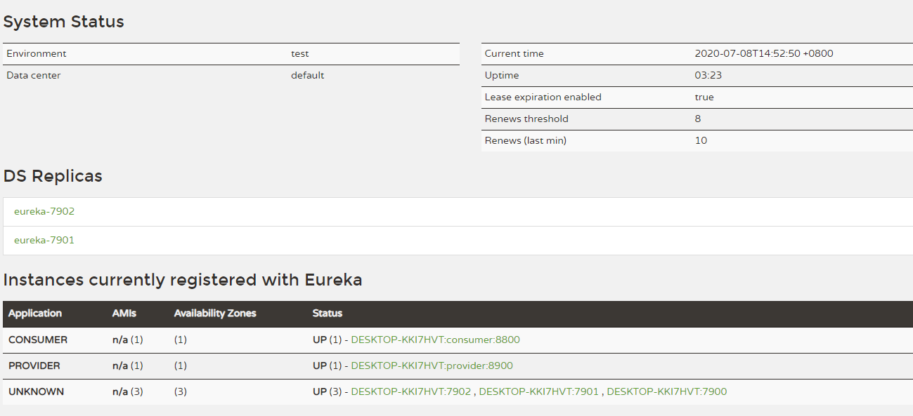

2. provider 增加 lombok 依赖

```
<dependency>
    <groupId>org.projectlombok</groupId>
    <artifactId>lombok</artifactId>
    <version>1.18.8</version>
</dependency>
```

3. provider 服务添加两个类

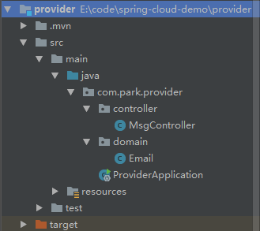

MsgController 类用来处理 consumer 发过来的请求

```
package com.park.provider.controller;

import com.park.provider.domain.Email;
import org.springframework.web.bind.annotation.PostMapping;
import org.springframework.web.bind.annotation.RequestBody;
import org.springframework.web.bind.annotation.RequestMapping;
import org.springframework.web.bind.annotation.RestController;

/**
 * @author BarryLee
 */
@RestController
@RequestMapping("/msg")
public class MsgController {

    @PostMapping("/sendEmail")
    public Email sendEmail(@RequestBody Email email) {
        System.out.println("provider 收到邮件：" + email);
        email.setContent("偷偷改一下内容");
        return email;
    }

}
```

```
package com.park.provider.domain;

import lombok.Data;

/**
 * @author BarryLee
 */
@Data
public class Email {
    private String email;
    private String content;
}
```

4. consumer 引入 OpenFeign 组件

```
<dependency>
    <groupId>org.springframework.cloud</groupId>
    <artifactId>spring-cloud-starter-openfeign</artifactId>
</dependency>

<!-- 顺便引入 lombok -->
<dependency>
    <groupId>org.projectlombok</groupId>
    <artifactId>lombok</artifactId>
    <version>1.18.8</version>
</dependency>
```

5. 在 consumer 的启动类添加注解：@EnableFeignClients

6. consumer 中添加几个类，Email 同 provider

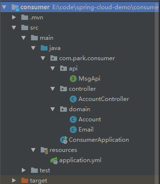

```
package com.park.consumer.domain;

import lombok.Data;

/**
 * @author BarryLee
 */
@Data
public class Account {
    private Integer id;
    private String username;
    private String password;
    private String email;
}
```

```
package com.park.consumer.api;

import com.park.consumer.domain.Email;
import org.springframework.cloud.openfeign.FeignClient;
import org.springframework.web.bind.annotation.PostMapping;
import org.springframework.web.bind.annotation.RequestBody;

/**
 * 这个类的所有注解都是给 Feign 看的，它会根据这里的注解来去组装一个 http 请求
 * 注解 FeignClient 标注服务名
 * @author BarryLee
 */
@FeignClient(name = "provider")
public interface MsgApi {
    /**
     * OpenFeign 相比较 Feign，它可以支持 SpringMVC 注解
     * 发送邮件
     */
    @PostMapping("/msg/sendEmail")
    Email sendEmail(@RequestBody Email email);
}

```

```
package com.park.consumer.controller;

import com.netflix.discovery.converters.Auto;
import com.park.consumer.api.MsgApi;
import com.park.consumer.domain.Account;
import com.park.consumer.domain.Email;
import org.springframework.beans.factory.annotation.Autowired;
import org.springframework.web.bind.annotation.PostMapping;
import org.springframework.web.bind.annotation.RequestBody;
import org.springframework.web.bind.annotation.RequestMapping;
import org.springframework.web.bind.annotation.RestController;

/**
 * @author BarryLee
 */
@RestController
@RequestMapping("/account")
public class AccountController {

    @Autowired
    private MsgApi msgApi;

    @PostMapping("/register")
    public Account register(@RequestBody Account account) {
        System.out.println("consumer 收到注册请求：" + account);

        Email email = new Email();
        email.setEmail(account.getEmail());
        email.setContent("打开网址xxx，激活你的账号噢");

        // 使用 OpenFeign 调用
        final Email res = msgApi.sendEmail(email);
        System.out.println("consumer 收到 provider 返回结果：" + res);

        account.setId(222);
        return account;
    }

}
```

7. 使用 postman 发送 post 请求测试 OpenFeign 调用

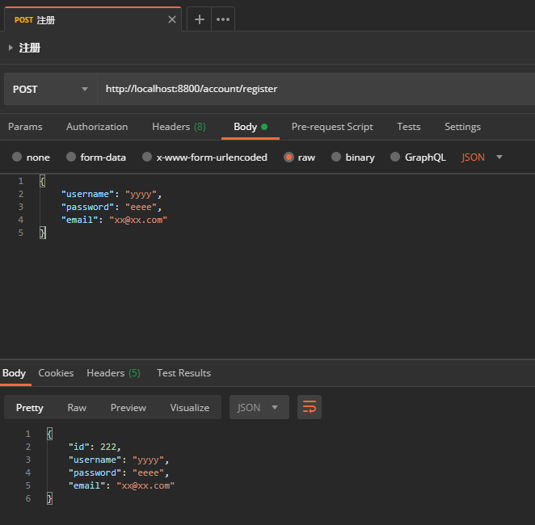

consumer 控制台输出

```
consumer 收到注册请求：Account(id=null, username=yyyy, password=eeee, email=xx@xx.com)
consumer 收到 provider 返回结果：Email(email=xx@xx.com, content=偷偷改一下内容)
```

provider 控制台输出

```
provider 收到邮件：Email(email=xx@xx.com, content=打开网址xxx，激活你的账号噢)
```

这整个过程就是：postman 发起一个请求到 consumer，consumer 接到请求使用 OpenFeign 发送了请求给provider

# Ribbon 客户端负载均衡

## 默认负载策略

1. 其实 OpenFeign 已经集成了 Ribbon 组件，如果上面的操作正确，那么一个轮询算法已经生效了。下面验证一下

2. 给 provider 服务添加两个配置文件，application-8901.yml 配置如下

```
server:
  port: 8901

spring:
  application:
    name: provider

eureka:
  client:
    register-with-eureka: true
    service-url:
      defaultZone: http://localhost:7900/eureka/
```

3. application-8902.yml 就跟 8901 的一样，端口号改成 8902 即可

4. 在 IDEA 的 EditConfiguration  中给 provider 配置这两个配置文件

5. provider 的 MsgController 类修改如下

```
    @Value("${server.port}")
    private String port;

    @PostMapping("/sendEmail")
    public String sendEmail(@RequestBody Email email) {
        System.out.println("provider port：" + port);
        System.out.println("provider 收到邮件：" + email);
        email.setContent("偷偷改一下内容");
        return port;
    }
```

6. consumer 的 MsgApi 修改如下

```
    @PostMapping("/msg/sendEmail")
    String sendEmail(@RequestBody Email email);
```

7. consumer 的 AccountController 修改如下

```
    @Autowired
    private MsgApi msgApi;

    @PostMapping("/register")
    public Account register(@RequestBody Account account) {
        System.out.println("consumer 收到注册请求：" + account);

        Email email = new Email();
        email.setEmail(account.getEmail());
        email.setContent("打开网址xxx，激活你的账号噢");

        // 使用 OpenFeign 调用
        String res = msgApi.sendEmail(email);
        System.out.println("consumer 收到 provider 返回端口：" + res);

		// 设置id为调用的 provider 的端口，方便直接查看调用情况
        account.setId(Integer.parseInt(res));
        return account;
    }
```

8. 下面开始测试，使用 postman 反复调用接口，可以发现端口是轮询出现的

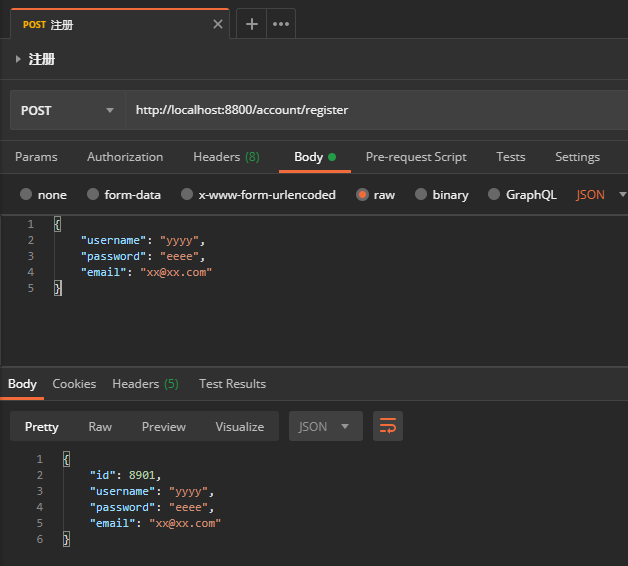

## 修改负载策略

在 consumer，也就是服务的调用方中修改配置文件

1. 给服务名为 provider 的服务修改负载策略为随机算法

```
provider:
  ribbon:
    NFLoadBalancerRuleClassName: com.netflix.loadbalancer.RandomRule
```

2. 全局配置方式，在任意被 spring 管理的类，比如启动类或者 @Component 的类中添加如下配置

```
@Bean
public IRule ribbonRule() {
	return new RandomRule();
}
```

其他算法类似

# Hystrix 熔断、降级、限流

Feign 自带 Hystrix，故不需要引入包

## FallBack

1. consumer 也就是服务调用方配置文件添加

```
feign:
  hystrix:
    enabled: true
```

2. 添加类 MsgFallBack

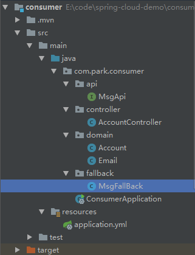

```
package com.park.consumer.fallback;

import com.park.consumer.api.MsgApi;
import com.park.consumer.domain.Email;
import org.springframework.stereotype.Component;

/**
 * @author BarryLee
 * 1.需要继承 MsgApi
 * 2.必须 spring 容器管理
 */
@Component
public class MsgFallBack implements MsgApi {
    @Override
    public String sendEmail(Email email) {
        System.out.println("发送邮件熔断了");
        return "-1";
    }
}
```

3. consumer 的 MsgApi 接口中修改注解 

```
@FeignClient(name = "provider", fallback = MsgFallBack.class)
```

4. 开始测试，先试一下正常的调用；然后将 provider 服务全部关掉，使用 postman 调用 /register 接口

控制台打印 “发送邮件熔断了”；id变成了 -1

## 开启 dashboard

也可以不使用这个来做监控

1. consumer 引入依赖

```
<dependency>
    <groupId>org.springframework.cloud</groupId>
    <artifactId>spring-cloud-starter-netflix-hystrix</artifactId>
</dependency>
<!-- hystrix dashboard -->
<dependency>
    <groupId>org.springframework.cloud</groupId>
    <artifactId>spring-cloud-starter-netflix-hystrix-dashboard</artifactId>
</dependency>
<dependency>
    <groupId>org.springframework.boot</groupId>
    <artifactId>spring-boot-starter-actuator</artifactId>
</dependency>
```

2. consumer 启动类添加注解

```
@EnableHystrixDashboard
@EnableCircuitBreaker
```

3. 配置文件添加

```
# 如果需要使用 hystrix dashboard 监控当前服务，需要暴露监控信息
management:
  endpoints:
    web:
      exposure:
        include: "*"
```

4. 重启服务，打开 http://localhost:8800/hystrix

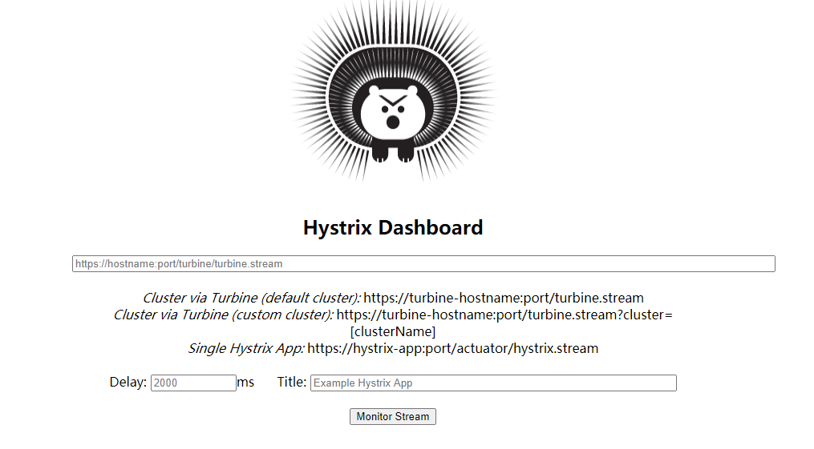

输入：http://localhost:8800/actuator/hystrix.stream

然后开始使用 postman 发请求

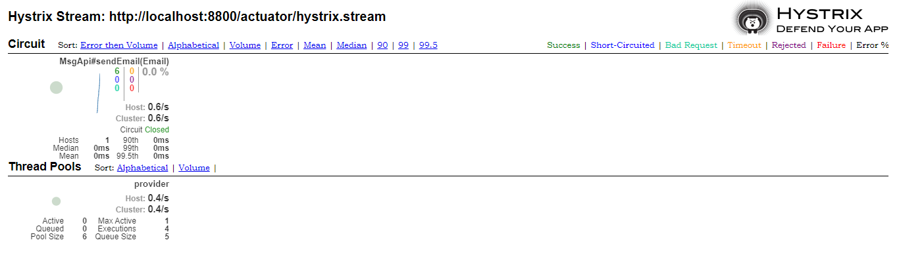

# Zuul 网关

zuul 默认集成了：ribbon 和 hystrix

## 启用网关

1. 添加一个模块 zuul，组件选择：web, eureka client, zuul

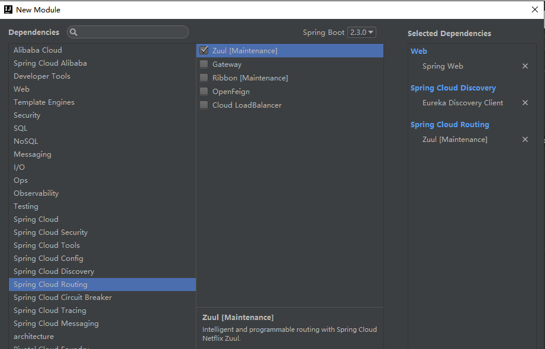

项目创建完成之后的目录如下

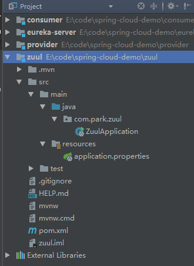

2. 配置文件 application.yml

```
server:
  port: 80
spring:
  application:
    name: zuul
eureka:
  client:
    service-url:
      defaultZone: http://localhost:7900/eureka/
```

3. 启动类添加注解

```
@EnableZuulProxy
@EnableEurekaClient
```

4. 启动 zuul，打开 http://localhost:7900/ 能看到 zuul 已经注册到了 eureka；然后使用 postman 测试接口

   http://localhost/consumer/account/register

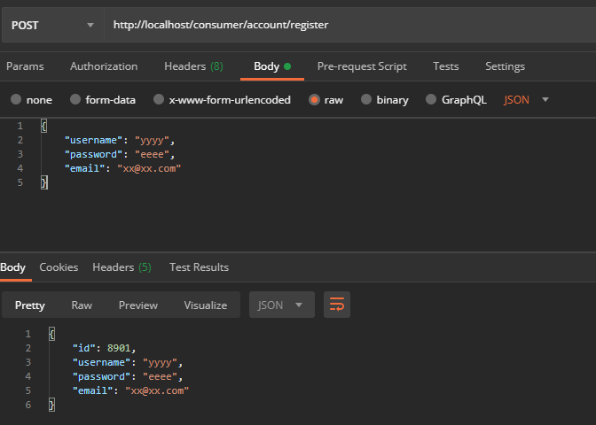

## 负载策略

使用起来与 consumer 一样。都是 Ribbon，默认情况下也是轮询策略

1. 单个服务配置方式如下，整体配置看文档的 Ribbon 部分

```
consumer:
  ribbon:
    NFLoadBalancerRuleClassName: com.netflix.loadbalancer.RandomRule
```

2. 测试。在 consumer 中添加如下代码进行测试

```
@Value("${server.port}")
private String port;

@GetMapping("/zuul")
public String testZuul() {
	return port;
}
```

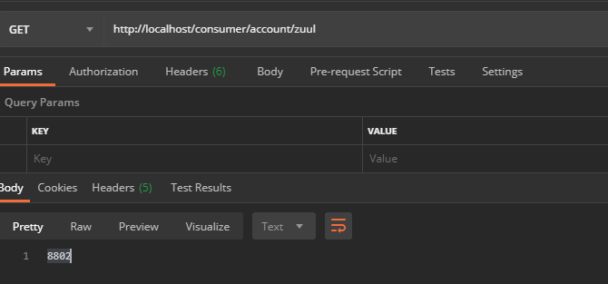

多次发送请求可以发现负载策略已经被修改

## Hystrix

# Zipkin 链路追踪

1. 到官网下载 server 端：https://zipkin.io/

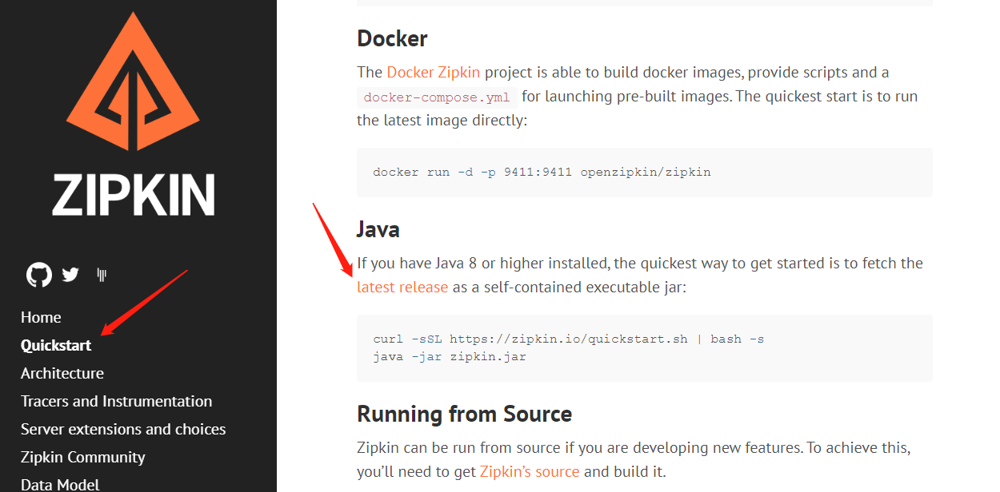

windows 下测试，直接 java -jar zipkin-server-2.21.5-exec.jar 启动

2. 启动之后打开 http://localhost:9411/zipkin/ ，可以看到已经部署成功
3. 在需要进行链路追踪的服务 比如 zuul、consumer、provider 的 pom 中添加依赖

```
<!-- zipkin -->
<dependency>
    <groupId>org.springframework.cloud</groupId>
    <artifactId>spring-cloud-starter-zipkin</artifactId>
</dependency>
```

在配置文件中添加

```
spring:
  #zipkin
  zipkin:
    base-url: http://localhost:9411/
  #采样比例1
  sleuth:
    sampler:
      rate: 1
```

4. 发送请求，比如前面已经写好的：

   http://localhost/consumer/account/zuul

   http://localhost/consumer/account/register

5. 此时在 zipkin 的页面中已经可以看到请求

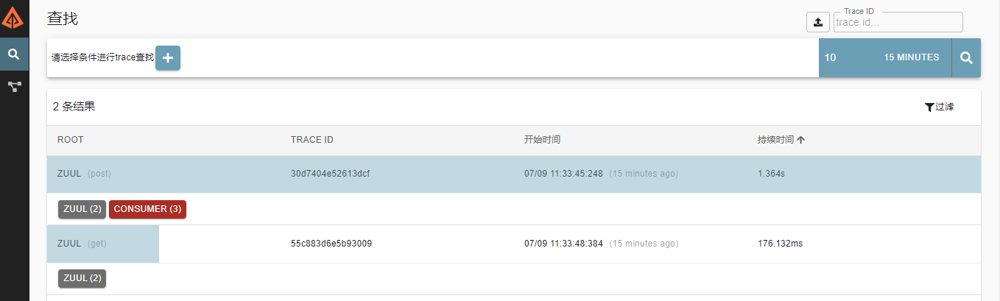

# Admin 健康检查

1. 创建 module admin，勾选依赖或者直接手动添加

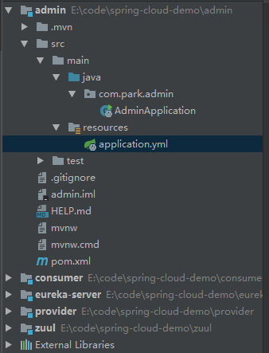

```
<!-- Admin 服务 -->
<dependency>
    <groupId>de.codecentric</groupId>
    <artifactId>spring-boot-admin-starter-server</artifactId>
</dependency>

<!-- Admin 界面 -->
<dependency>
    <groupId>de.codecentric</groupId>
    <artifactId>spring-boot-admin-server-ui</artifactId>
</dependency>
```

2. 启动类添加注解

```
@EnableAdminServer
```

3. 在需要被监控的服务 pom 添加依赖

```
<dependency>
	<groupId>org.springframework.boot</groupId>
	<artifactId>spring-boot-starter-actuator</artifactId>
	<version>2.2.1</version>
</dependency>
<dependency>
    <groupId>org.springframework.boot</groupId>
    <artifactId>spring-boot-starter-actuator</artifactId>
</dependency>
```

在配置文件添加

```
# 上报健康信息到 admin
spring:
  boot:
    admin:
      client:
        url: http://localhost:6010/

# 暴露端点
management:
  endpoints:
    web:
      exposure:
        include: "*"
```

4. 重启服务，打开 http://localhost:6010/wallboard

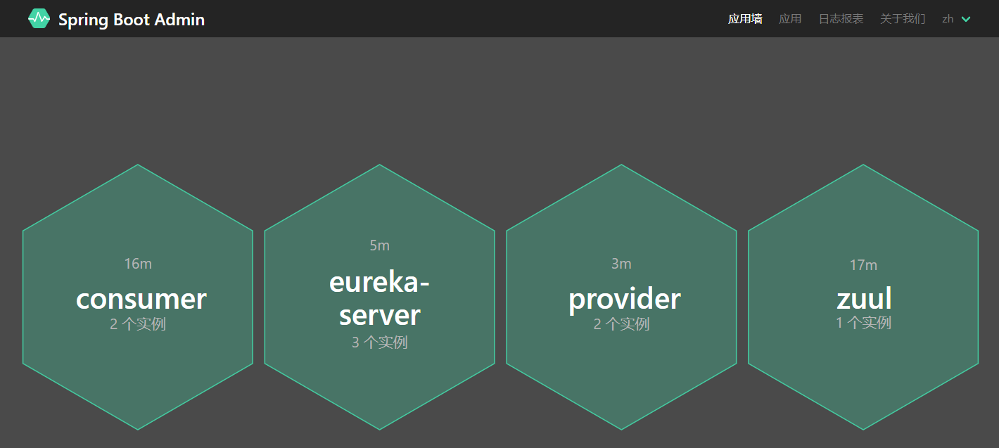

点开可以看到详细信息

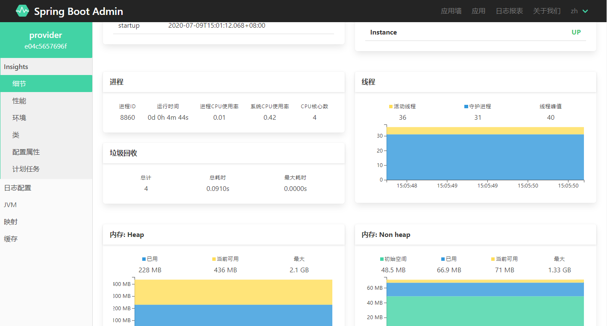

一般服务下线都需要配置邮件或者钉钉消息来使用

# Config 配置中心

## 服务端搭建

1. 继续添加 module config，依赖选择 config server，eureka client，actuator

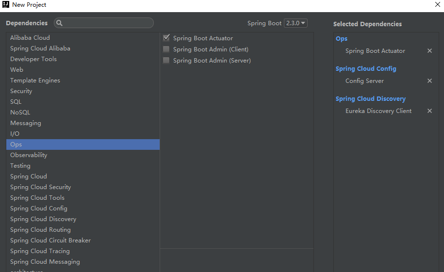

现在的项目结构

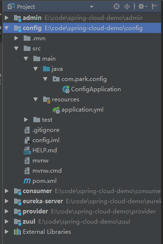

2. 启动类添加注解

```
@EnableConfigServer
```

3. 配置文件

```
server:
  port: 5900

spring:
  application:
    name: config
  cloud:
    config:
      server:
        git:
          uri: https://github.com/{你的Git}/config-center.git
      label: master

eureka:
  client:
    service-url:
      defaultZone: http://localhost:7900/eureka/
```

## Git 仓库

1. 在你的 git 新建一个仓库：config-server
2. 新增一个文件：consumer-dev.yml

```
spring:
  application:
    name: consumer
  boot:
    admin:
      client:
        url: http://localhost:6010/
  #zipkin
  zipkin:
    base-url: http://localhost:9411/
    #采样比例1
  sleuth:
    sampler:
      rate: 1

eureka:
  client:
    register-with-eureka: true
    fetch-registry: true
    service-url:
      defaultZone: http://localhost:7900/eureka/

# 修改 Ribbon 负载策略，provider 为具体服务的服务名
provider:
  ribbon:
    NFLoadBalancerRuleClassName: com.netflix.loadbalancer.RandomRule

# 启用 hystrix
feign:
  hystrix:
    enabled: true

# 如果需要监控当前服务，需要暴露监控信息
management:
  endpoints:
    web:
      exposure:
        include: "*"

# 用来测试能否通过配置中心更新配置
configText: park111
```

3. 打开 http://localhost:5900/consumer-dev.yml 可以看到页面显示了仓库中的 consumer-dev.yml文档，也就是我们的配置中心 server 端 ready 了

## 客户端配置

### actuator 刷新配置

此配置可以刷新单一个服务的单一个节点的配置

1. 比如 consumer，首先，引入 spring cloud config client，以及 actuator 依赖

```
<!-- config-client -->
<dependency>
    <groupId>org.springframework.cloud</groupId>
    <artifactId>spring-cloud-config-client</artifactId>
</dependency>
<!-- actuator -->
<dependency>
    <groupId>org.springframework.boot</groupId>
    <artifactId>spring-boot-starter-actuator</artifactId>
</dependency>
```

2. 将 application.yml 配置文件改成 **bootstrap.properties** 

```
#配置中心
spring.cloud.config.uri=http://localhost:5900

#git 分支
spring.cloud.config.label=master

#下面两个配置，相当于启用配置文件：application-test.yml，这里就是 consumer-dev.yml
#application 部分
spring.cloud.config.name=consumer
#profile 部分
spring.cloud.config.profile=dev

#refresh 允许更新，也可以用 * 来暴露所有端点
management.endpoints.web.exposure.include=*
```

3. consumer 的 AccountController 类加入注解，加入这个注解之后，当前类的所有 @Value 注解都会被更新

```
@RefreshScope
```

4. AccountController 类加入代码，用来测试配置文件更新

```
/**
 * 从配置文件读取，用来测试配置文件是否更新成功
 */
@Value("${configText}")
private String configText;

@GetMapping("/testConfig")
    public String testConfig() {
    return configText;
}
```

5. 启动 consumer 测试一下是否从配置中心拉取了配置文件 consumer-dev.yml，发送一个 get 请求：http://localhost:8800/account/testConfig ，返回了 configText，说明拉取成功
6. 更新 git 上配置文件 consumer-dev.yml 中的 configText 为 park222

```
# 用来测试能否通过配置中心更新配置
configText: park222
```

7. 手动刷新，调用 post 请求，http://localhost:8800/actuator/refresh

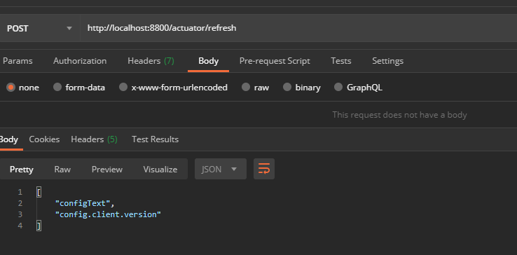

8. 再次发送一个 get 请求：http://localhost:8800/account/testConfig ，可以看到此时 configText 已经变成了 park222，说明手动刷新配置文件成功

### amqp 刷新配置

此配置可以刷新一整个服务所有节点的配置

1. 安装 Erlang：https://www.erlang.org/downloads

   下载 22.3 版本，**不要下载 23.0**，坑巨多就是了

   下载之后，使用**管理员身份运行**，不建议使用默认安装路径；安装完之后，需要配置环境变量

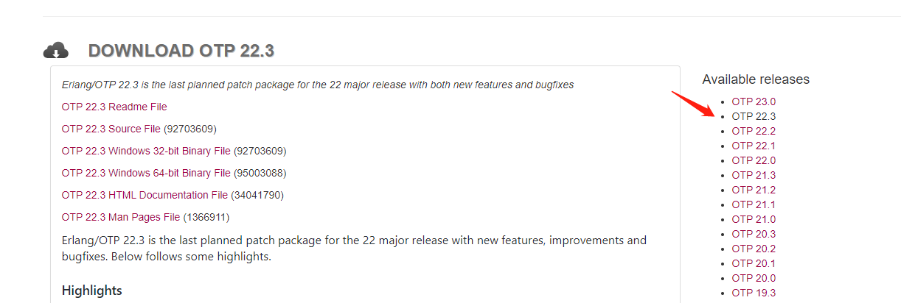

​	配置好环境变量之后，cmd 随便一个位置输入 erl

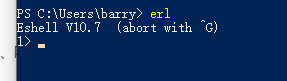

2. 安装 RabbitMQ (windows下)：https://www.rabbitmq.com/download.html

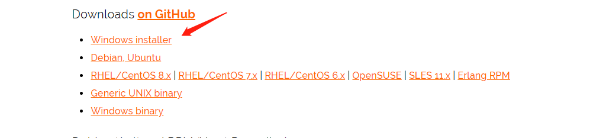

​	安装好之后，到其 sbin 目录下，打开 cmd，输入一下两个指令

```
# 开启RabbitMQ节点
rabbitmqctl start_app
# 开启RabbitMQ管理模块的插件，并配置到RabbitMQ节点上
rabbitmq-plugins enable rabbitmq_management
```

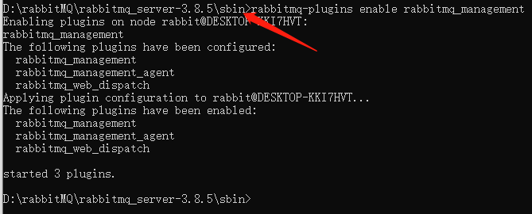

​	之后在 sbin 目录下双击 rabbitmq-server.bat

​	然后打开 http://localhost:15672/ ，用户名、密码都是 guest

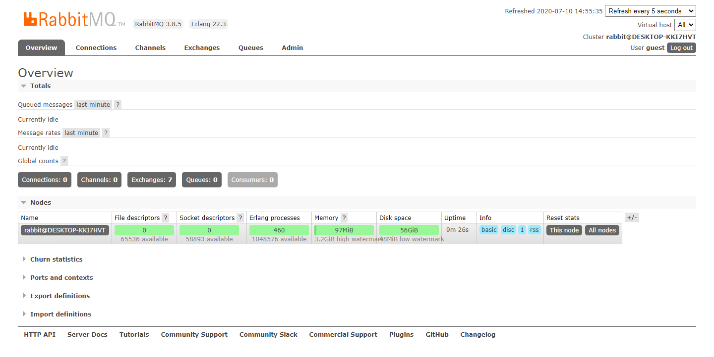

3. config server 和 consumer 都要添加依赖

```
<!-- bus-amqp -->
<dependency>
    <groupId>org.springframework.cloud</groupId>
    <artifactId>spring-cloud-starter-bus-amqp</artifactId>
</dependency>
```

4. config server 目前的配置，主要是添加了 rabbitmq

```
server:
  port: 5900

spring:
  application:
    name: config-server
  cloud:
    config:
      server:
        #git地址
        git:
          uri: https://github.com/blppz/config-center.git/
      #git分支
      label: master
  rabbitmq:
    host: localhost
    port: 5672
    username: guest
    password: guest

eureka:
  client:
    service-url:
      defaultZone: http://localhost:7900/eureka/
```

5. consumer 的 bootstrap.properties 目前为

```
#配置中心
spring.cloud.config.uri=http://localhost:5900

#git 分支
spring.cloud.config.label=master

#下面两个配置，相当于启用配置文件：application-test.yml，这里就是 consumer-dev.yml
#application 部分
spring.cloud.config.name=consumer
#profile 部分
spring.cloud.config.profile=dev

#暴露所有端点
management.endpoints.web.exposure.include=*

spring.rabbitmq.host=localhost
spring.rabbitmq.port=5672
spring.rabbitmq.username=guest
spring.rabbitmq.password=guest
```

6. 重启这两个服务。

   a. 瞄一眼当前 git 中的 configText 为 park111，GET 请求一下：http://localhost:8800/account/testConfig

   b. 然后修改 git 中的 configText 为 park222，再请求一下：http://localhost:8800/account/testConfig ，发现并没有改变

   c. POST 请求：http://localhost:8800/actuator/bus-refresh ，再调用 testConfig

### webhooks 配置自动刷新

**一般不建议使用自动刷新**，因为很难保证修改之后的配置文件是正确的，实在需要配置，那也是先在单台机器上刷新测试过配置文件没问题再批量的自动刷新

1. 打开配置中心的 git 仓库，添加一个 webhooks

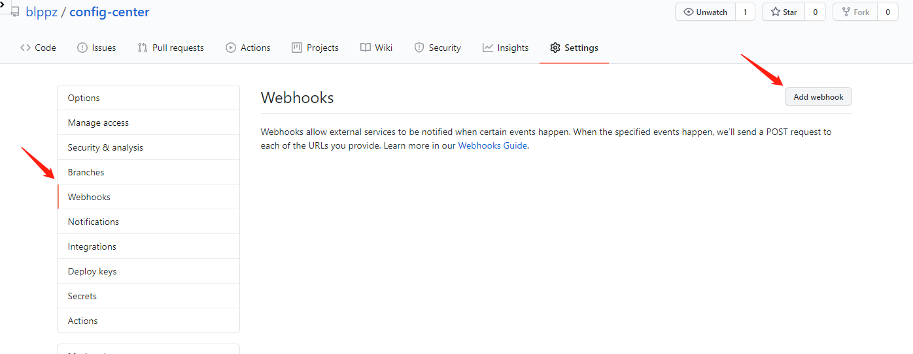

2. Payload URL 填写的是刷新的地址，git 能访问的地址，如果是内网，那公司的 gitlab 仓库也能访问

​	http://host:port/actuator/refresh

​	或者

​	http://host:port/actuator/bus-refresh

3. 如果 Secret 写了，就在配置文件中填写 encrypt.key 与之对应即可

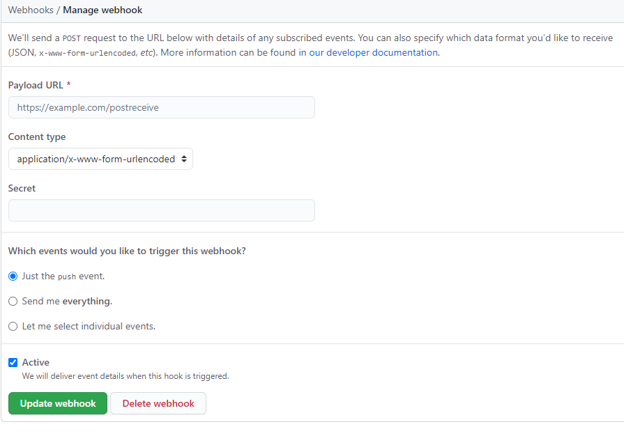

