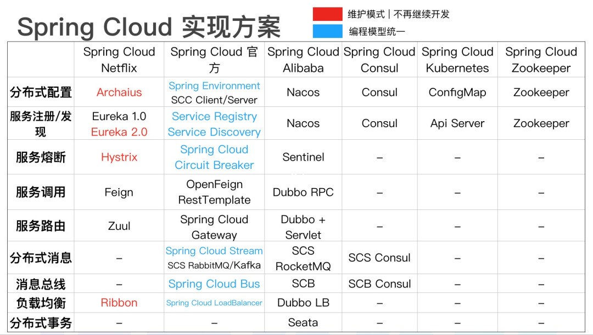
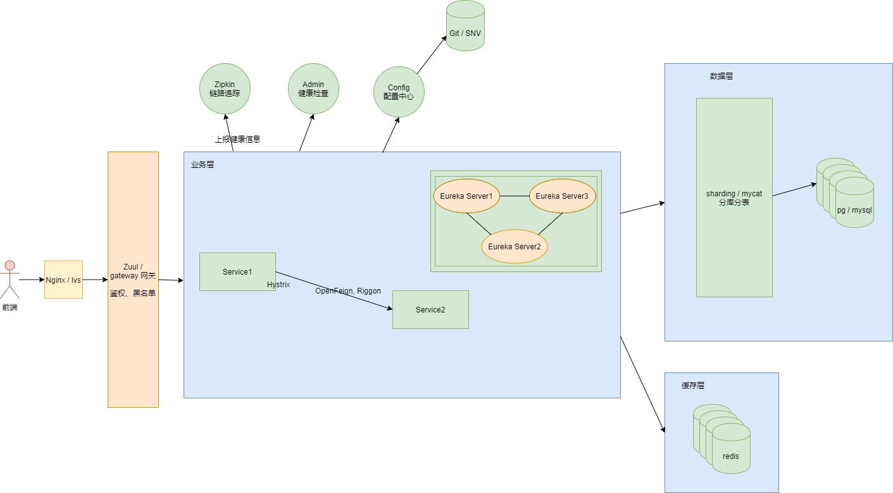
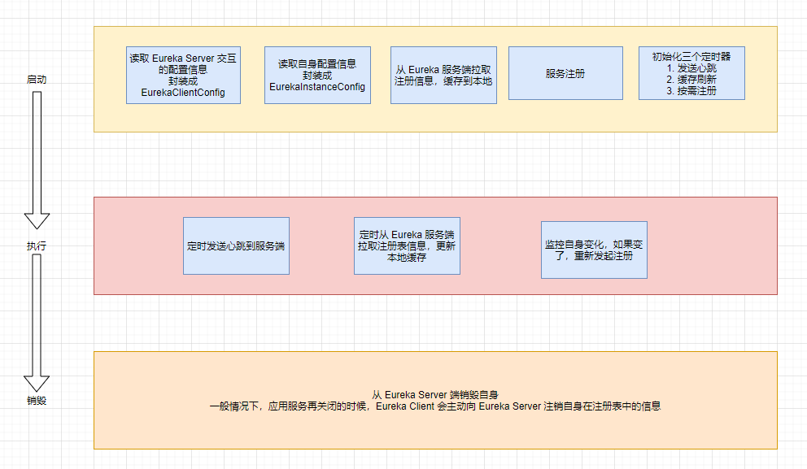
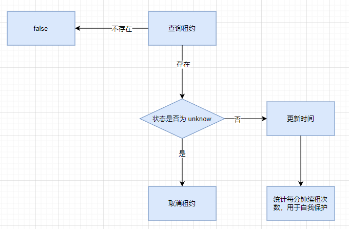
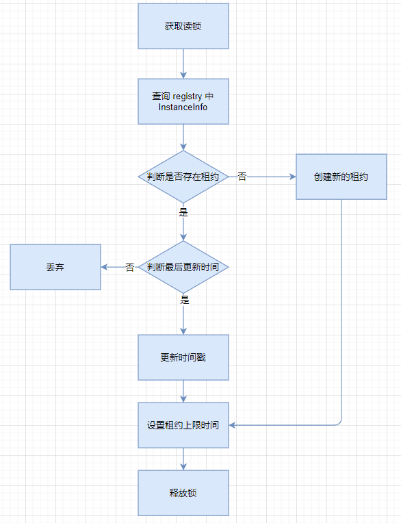
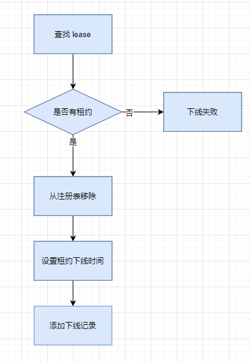
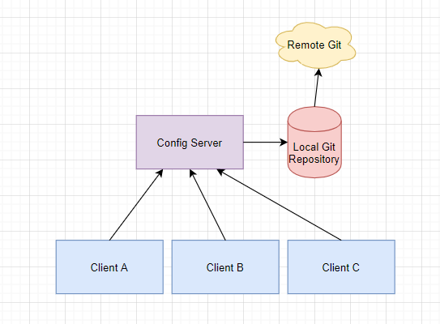

# Spring Cloud 概述

## 几套实现方案参考



## Spring Cloud 基础技术点

Eureka：服务注册与发现，用于服务管理

Feign： 服务间调用，能够简化 HTTP 接口的调用

Ribbon：基于客户端的负载均衡

Hystrix：熔断降级，防止服务雪崩

Zuul：网关路由，提供路由转发、请求过滤、限流降级等功能

Config：配置中心，分布式配置管理

Sleuth：服务链路追踪

Admin：健康管理

*满足大部分场景，目前仍有很多的公司在使用。以下内容基于这一套实现方案来讲*

## **分布式常见架构图：**



## Spring Cloud Alibaba

**[Sentinel](https://github.com/alibaba/Sentinel)**：把流量作为切入点，从流量控制、熔断降级、系统负载保护等多个维度保护服务的稳定性

**[Nacos](https://github.com/alibaba/Nacos)**：一个更易于构建云原生应用的动态服务发现、配置管理和服务管理平台

**[RocketMQ](https://rocketmq.apache.org/)**：一款开源的分布式消息系统，基于高可用分布式集群技术，提供低延时的、高可靠的消息发布与订阅服务

**[Dubbo](https://github.com/apache/dubbo)**：Apache Dubbo™ 是一款高性能 Java RPC 框架

**[Seata](https://github.com/seata/seata)**：阿里巴巴开源产品，一个易于使用的高性能微服务分布式事务解决方案

**[Alibaba Cloud ACM](https://www.aliyun.com/product/acm)**：一款在分布式架构环境中对应用配置进行集中管理和推送的应用配置中心产品

**[Alibaba Cloud OSS](https://www.aliyun.com/product/oss)**: 阿里云对象存储服务（Object Storage Service，简称 OSS），是阿里云提供的海量、安全、低成本、高可靠的云存储服务。您可以在任何应用、任何时间、任何地点存储和访问任意类型的数据

**[Alibaba Cloud SchedulerX](https://help.aliyun.com/document_detail/43136.html)**: 阿里中间件团队开发的一款分布式任务调度产品，提供秒级、精准、高可靠、高可用的定时（基于 Cron 表达式）任务调度服务

**[Alibaba Cloud SMS](https://www.aliyun.com/product/sms)**: 覆盖全球的短信服务，友好、高效、智能的互联化通讯能力，帮助企业迅速搭建客户触达通道

*未来将会有越来越多的公司拥抱 Spring Cloud Alibaba，更简便的调用、更优雅的实现、更活跃的社区*

## 微服务设计原则

单一职责原则：关注整个系统功能中单独，有界限的一部分

服务自治原则：可以独立开发，测试，构建，部署，运行，与其他服务解耦

轻量级通信原则：轻，跨平台，跨语言。REST, AMQP 等

粒度把控：与自己实际相结合。 不要追求完美，随业务进化而调整。书《淘宝技术这10年》

# 服务注册与发现

## 注册中心组件

Eureka，Nacos，Consul，Zookeeper 等

## 服务器端

Server 是一个公共服务，为 Client 提供服务注册和发现的功能，维护注册到自身的 Client 的相关信息，同时提供接口给 Client 获取注册表中其他服务的信息，使得动态变化的 Client 能够进行服务间的相互调用

## 客户端

Client 将自己的服务信息通过一定的方式登记到 Server 上，并在正常范围内维护自己信息一致性，方便其他服务发现自己，同时可以通过 Server 获取到自己依赖的其他服务信息，完成服务调用，还内置了负载均衡器，用来进行基本的负载均衡

## Client 功能

1. 注册：每个微服务启动时，将自己的网络地址等信息注册到注册中心，注册中心会存储（内存中）这些信息
2. 获取服务注册表：服务消费者从注册中心，查询服务提供者的网络地址，并使用该地址调用服务提供者，为了避免每次都查注册表信息，所以client会定时去server拉取注册表信息到缓存到client本地

3. 心跳：各个微服务与注册中心通过某种机制（心跳）通信，若注册中心长时间和服务间没有通信，就会注销该实例

4. 调用：实际的服务调用，通过注册表，解析服务名和具体地址的对应关系，找到具体服务的地址，进行实际调用

## Server 注册中心功能

1. 服务注册表：记录各个微服务信息，例如服务名称，ip，端口等，注册表提供 查询API（查询可用的微服务实例）和管理 API（用于服务的注册和注销）

2. 服务注册与发现：

   ​	注册：将微服务信息注册到注册中心

   ​	发现：查询可用微服务列表及其网络地址

3. 服务检查：定时检测已注册的服务，如发现某实例长时间无法访问，就从注册表中移除

## Eureka 高可用

可以通过运行多个 Eureka Server 实例并相互注册的方式实现，Server 节点之间会彼此增量地同步信息，从而确保节点中数据一致

## 自我保护

1. 默认情况下，Eureka Server 在一定时间内，没有接收到某个微服务心跳，会将某个微服务注销（90S），但是当网络故障时，微服务与 Server 之间无法正常通信，上述行为就非常危险，因为微服务正常，不应该注销

2. 自我保护思想：宁可保留健康的和不健康的，也不盲目注销任何健康的服务
3. 默认情况下，自我保护功能是打开的，但是很多公司都会关闭这个功能，因为不在线的服务如果存在于服务实例列表中就可能影响到正常的调用，服务非正常下线的可能性其实也并不高，并且可以通过 Admin 组件来通知服务下线
4. 自我保护触发条件：
   1. 打开自我保护 --> eureka.server.enable-self-preservation=true
   2. 当每分钟心跳次数( renewsLastMin ) 小于 numberOfRenewsPerMinThreshold

> 计算公式
>
> numberOfRenewsPerMinThreshold = expectedNumberOfRenewsPerMin * 续租百分比 ( eureka.server.renewalPercentThreshold, 默认 0.85 )
>
> expectedNumberOfRenewsPerMin = 当前注册的应用实例数 x 2
>
> 为什么乘以 2 呢？默认情况下，注册的应用实例每半分钟续租一次，那么一分钟心跳两次

## 基本原理

有兴趣的同学这部分建议自己跟源码

### Eureka Client 生命周期



### Eureka Server 接收心跳



### Eureka Server 注册



### Eureka 服务下线



# 服务间调用

## 几种方式

1. http：硬编码，不好维护

   可以用 Map<服务名, 服务实例列表> 的数据结构来存储服务实例

2. RestTemplate：比较自由，调用第三方 api 比较方便

3. Feign：需要一定的配置，但是更为优雅

4. Dubbo：字节级别，快

### RestTemplate

```
@Bean
public RestTemplate restTemplate() {
	return new RestTemplate();
}
```

### Feign 和 OpenFeign

1. Feign 本身不支持 Spring MVC 的注解，它有一套自己的注解

2. OpenFeign 是 Spring Cloud 在 Feign 的基础上支持了 Spring MVC 的注解，如 @RequesMapping 等等 OpenFeign 的 @FeignClient 可以解析 SpringMVC 的 @RequestMapping 注解下的接口， 并通过动态代理的方式产生实现类，实现类中做负载均衡并调用其他服务

## Feign 原理

1. 主程序入口添加 @EnableFeignClients 注解开启对 Feign Client 扫描加载处理。根据 Feign Client 的开发规范，定义接口并加 @FeignClient 注解
2. 当程序启动时，会进行包扫描，扫描所有 @FeignClient 注解的类，并将这些信息注入 Spring IoC 容器中。当定义的 Feign 接口中的方法被调用时，通过 JDK 的代理方式，来生成具体的 RequestTemplate。当生成代理时，Feign 会为每个接口方法创建一个 RequestTemplate 对象，该对象封装了 HTTP 请求需要的全部信息，如请求参数名、请求方法等信息都在这个过程中确定
3. 然后由 RequestTemplate 生成 Request，然后把这个 Request 交给 Client 处理，这里指的 Client 可以是 JDK 原生的 URLConnection、Apache 的 Http Client，也可以是 Okhttp。最后 Client 被封装到 LoadBalanceClient 类，这个类结合 Ribbon 负载均衡发起服务之间的调用

## 超时和重试

Feign 默认支持 Ribbon，Ribbon 的重试机制和 Feign 的重试机制有冲突，所以源码中默认关闭 Feign 的重试机制，使用 Ribbon 的重试机制

```
ribbon:
  #连接超时时间(ms)
  ConnectTimeout: 1000
  #业务逻辑超时时间(ms)
  ReadTimeout: 6000
```

使用 Ribbon 重试机制，请求失败后，每隔 6 秒会重新尝试

```
ribbon:
  #同一台实例最大重试次数,不包括首次调用
  MaxAutoRetries: 1
  #重试负载均衡其他的实例最大重试次数,不包括首次调用
  MaxAutoRetriesNextServer: 1
  #是否所有操作都重试
  OkToRetryOnAllOperations: false
```

# 负载均衡

## 分类

1. 硬件负载：F5
2. 软件负载：客户端、服务端

## 区别

客户端负载跟服务端负载的本质区别在于：服务列表地址和负载算法放在哪里

Nginx 就是服务端负载，Ribbon 就是客户端负载

## 实现

1. Ribbon 可以单独使用，作为一个独立的负载均衡组件。只是需要我们手动配置 服务地址列表
2. Ribbon 与 Eureka 配合使用时，Ribbon 可自动从 Eureka Server 获取服务提供者地址列表（DiscoveryClient），并基于负载均衡算法，请求其中一个服务提供者实例
3. Ribbon 与 OpenFeign 和 RestTemplate 进行无缝对接，让二者具有负载均衡的能力。OpenFeign 基于 Feign，而 Feign 默认集成了 Ribbon

## 负载策略

### 默认策略

ZoneAvoidanceRule（区域权衡策略）：复合判断 Server 所在区域的性能和 Server 的可用性，轮询选择服务器

### 其他策略

1. BestAvailableRule（最低并发策略）：会先过滤掉由于多次访问故障而处于断路器跳闸状态的服务，然后选择一个并发量最小的服务。逐个找服务，如果断路器打开，则忽略

2. RoundRobinRule（轮询策略）：以简单轮询选择一个服务器。按顺序循环选择一个 Server

3. RandomRule（随机策略）：随机选择一个服务器

4. AvailabilityFilteringRule（可用过滤策略）：会先过滤掉多次访问故障而处于断路器跳闸状态的服务和过滤并发的连接数量超过阀值得服务，然后对剩余的服务列表安装轮询策略进行访问

5. WeightedResponseTimeRule（响应时间加权策略）：据平均响应时间计算所有的服务的权重，响应时间越快服务权重越大，容易被选中的概率就越高。刚启动时，如果统计信息不全面，则使用 RoundRobinRule(轮询)策略，等统计的信息足够了会自动的切换到 WeightedResponseTimeRule。响应时间长，权重低，被选择的概率低。反之，同样道理。此策略综合了各种因素（网络，磁盘，IO 等），这些因素直接影响响应时间

6. RetryRule（重试策略）：先按照 RoundRobinRule (轮询)的策略获取服务，如果获取的服务失败则在指定的时间会进行重试，进行获取可用的服务。如多次获取某个服务失败，就不会再次获取该服务。主要是在一个时间段内，如果选择一个服务不成功，就继续找可用的服务，直到超时

# 熔断

Hystrix，是一个容错组件，实现了超时机制和断路器模式，用于隔离远程系统、服务或者第三方库，防止级联失败，从而提升系统的可用性与容错性

主要有以下几点功能：

Hystrix是Netflix开源的一个类库，用于隔离远程系统、服务或者第三方库，防止级联失败，从而提升系统的可用性与容错性。主要有以下几点功能：

1. 为系统提供保护机制：在依赖的服务出现高延迟或失败时，为系统提供保护和控制
2. 防止雪崩：雪崩就是 - 所依赖的服务崩了，本服务也跟着崩了，依赖本服务的其他服务也崩了
3. 包裹请求：使用 HystrixCommand（或 HystrixObservableCommand）包裹对依赖的调用逻辑，每个命令在独立线程中运行
4. 跳闸机制：当某服务失败率达到一定的阈值时，Hystrix 可以自动跳闸，停止请求该服务一段时间
5. 资源隔离：Hystrix 为每个请求的依赖都维护了一个小型线程池，如果该线程池已满，发往该依赖的请求就被立即拒绝，而不是排队等候，从而加速失败判定。防止级联失败
6. 快速失败：Fail Fast。同时能快速恢复。侧重点是：（不去真正的请求服务，发生异常再返回），而是直接失败
7. 监控：Hystrix 可以实时监控运行指标和配置的变化，提供近实时的监控、报警、运维控制
8. 回退机制：fallback，当请求失败、超时、被拒绝，或当断路器被打开时，执行回退逻辑。回退逻辑我们自定义，提供优雅的服务降级
9. 自我修复：断路器打开一段时间后，会自动进入“半开”状态，可以进行打开，关闭，半开状态的转换

# 网关

> 一般来讲，网关处在外网，是对外的一个窗口，需要鉴权、黑名单校验；而其他的服务则处在内网，没必要重复做安全认证

## 基本功能

Zuul 默认集成了 Ribbon 和 Hystrix。核心是一系列的过滤器，这些过滤器可以完成以下的功能

1. 所有微服务入口，进行分发
2. 身份认证与安全：识别合法的请求，拦截不合法的请求
3. 监控：入口处监控，更全面
4. 动态路由：动态将请求分发到不同的后端集群
5. 压力测试：可以逐渐增加对后端服务的流量，进行测试
6. 负载均衡：也是用 Ribbon
7. 限流：比如我每秒只要 1000 次，10001 次就不让访问了
8. 服务熔断

## 路由端点

调试的时候，看网关请求的地址，以及映射是否正确。网关请求有误时，可以通过此处排查错误

```
management:
  endpoint:
    health:
      enabled: true
      show-details: always
    routes:
      enabled: true
  endpoints:
    web:
      exposure:
        include: '*'
```

## 高可用

网关集群，前面再加一层 Nginx / LVS

# 链路追踪


> 面对错综复杂的服务调用中链路的查看以及排查慢服务的难题，我们可以使用链路追踪技术来解决 -- 鲁迅

## 链路追踪产品

目前大部分都是基于 google 的 Dapper 论文来进行实现的

> Zipkin：twitter 开源，严格按照谷歌的 Dapper 论文来
> Pinpoint：韩国的 Naver 公司的
> Cat：美团的
> EagleEye：淘宝的
> SkyWalking：UI 好看，发展的有点生猛

# 配置中心

## 场景

1. 微服务比较多，成百上千，配置很多，需要集中管理
2. 管理不同环境的配置
3. 需要动态调整配置参数，更改配置不停服

## 工作流程



# 常见问题总结

1. 解决服务注册慢，被其他服务发现慢的问题。建议用默认值，默认是30秒

```
#因为服务最少续约3次心跳才能被其他服务发现，所以我们缩短心跳时间
eureka.instance.lease-renewal-interval-in-seconds: 10
```

2. 已停止的微服务节点，注销慢或不注销。建议默认

eureka server

```
eureka:
  server: 
    #关闭自我保护
    enable-self-preservation: false
    #缩短清理间隔时间
    eviction-interval-timer-in-ms: 5000
```

eureka client

```
eureka:
  instance:
    #缩短心跳间隔。默认30秒
    lease-renewal-interval-in-seconds: 10
    #缩短续约到期时间，默认90秒
    lease-expiration-duration-in-seconds: 90
```

3. 整合 hystrix 后，首次请求失败

原因：hystrix 默认超时时间是 1 秒，如果 1 秒内无响应，就会走 fallback 逻辑。由于 Spring 的懒加载机制，首次请求要去获取注册表信息等。所以首次请求一般会超过 1 秒

解决方法 1：配置饥饿加载

```
服务调用方
ribbon:
  eager-load:
    enabled: true
    clients: 

如果是网关
zuul:
  ribbon:
    eager-load:
      enabled: true
```

解决方法 2：设长 hystrix 超时时间，在 command 命令中设置

```
execution:
  isolation:
    thread:
      timeoutInMilliseconds: 
```

# 推荐文章

微服务概述：https://www.cnblogs.com/liuning8023/p/4493156.html

注册中心：http://jm.taobao.org/2016/09/28/an-article-about-config-center/